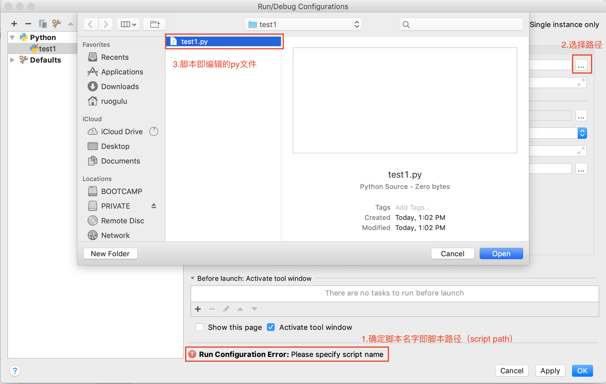

# Jupyter Notebook使用教程

## 1 Jupyter Notebook简介
### 1. **简介**  

>Jupyter Notebook是基于网页的用于交互计算的应用程序。其可被应用于全过程计算：开发、文档编写、运行代码和展示结果。&nbsp;&nbsp;&nbsp;&nbsp;&nbsp;&nbsp;&nbsp;&nbsp;&nbsp;&nbsp;&nbsp;&nbsp;&nbsp;&nbsp;&nbsp;&nbsp;&nbsp;&nbsp;&nbsp;&nbsp;&nbsp;&nbsp;&nbsp;&nbsp;&nbsp;&nbsp;&nbsp;&nbsp;&nbsp;&nbsp;&nbsp;&nbsp;&nbsp;&nbsp;&nbsp;&nbsp;&nbsp;&nbsp;&nbsp;&nbsp;&nbsp;&nbsp;&nbsp;&nbsp;&nbsp;——Jupyter Notebook官方介绍

	  
&nbsp;&nbsp;&nbsp;&nbsp;&nbsp;&nbsp;&nbsp;简而言之，Jupyter Notebook是以网页的形式打开，可以在网页页面中直接编写代码和运行代码，代码的运行结果也会直接在代码块下显示的程序。如在编程过程中需要编写说明文档，可在同一个页面中直接编写，便于作及时的说明和解释.  
### 2. 组成部分  
+ 网页应用  
网页应用即基于网页形式的、结合了编写说明文档、数学公式、交互计算和其他富媒体形式的工具。简言之，网页应用是可以实现各种功能的工具。  
+ 文档  
即Jupyter Notebook中所有交互计算、编写说明文档、数学公式、图片以及其他富媒体形式的输入和输出，都是以文档的形式体现的。这些文档是保存为后缀名为.ipynb的JSON格式文件，不仅便于版本控制，也方便与他人共享。  
此外，文档还可以导出为：HTML、LaTeX、PDF等格式。  

### 3. Jupyter Notebook的主要特点  
① 编程时具有语法高亮、缩进、tab补全的功能。  
② 可直接通过浏览器运行代码，同时在代码块下方展示运行结果。  
③ 以富媒体格式展示计算结果。富媒体格式包括：HTML，LaTeX，PNG，SVG等。  
④ 对代码编写说明文档或语句时，支持Markdown语法。  
⑤ 支持使用LaTeX编写数学性说明。
## 2 问题积累
1. **如何在jupyter notebook中运行.py文件?**
	* 在\*\*\*.py文件的同一目录下建立一个\*\*\*.ipynb文件如图  
	
	* 在\*\*\*.ipynb文件中输入```%run \*\*\*\.py```或python文件的绝对路径，详情见图：  
	
2. Select run/debug configuration (选择run/debug的配置信息)
	* Edit Configuration  
	
	* Create a new configuration  
	
	* Script path  
	
3. Test and Success (测试运行，试着打印一句话)  
	
