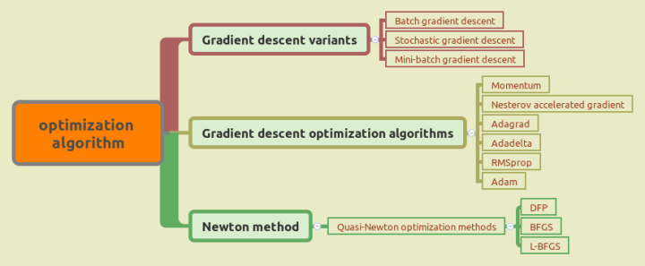
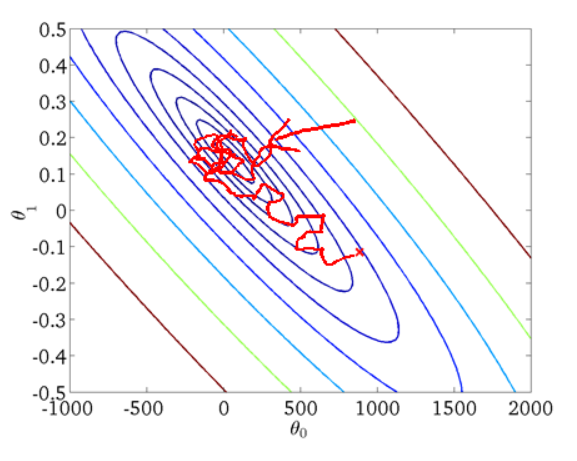
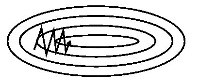
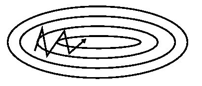
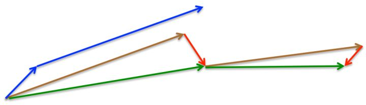
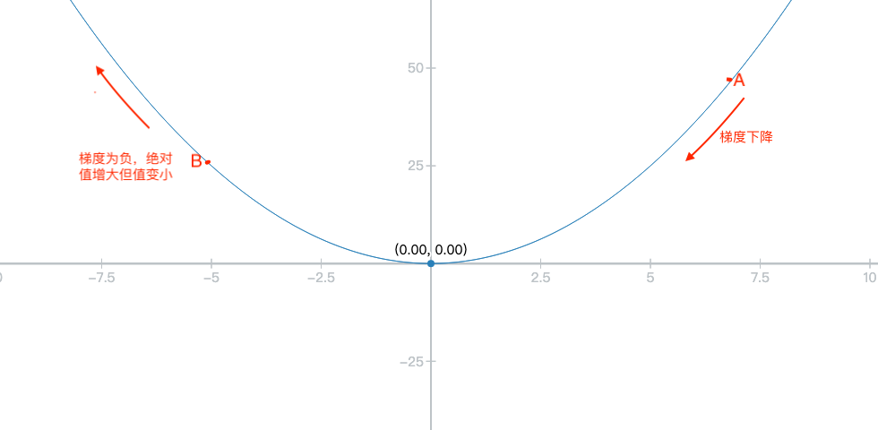

Table of Contents
=================

   * [第4章 算法优化](#第4章-算法优化)
      * [       <strong>通过改善训练方式，来最小化(或最大化)损失函数E(x)</strong>(目标函数)](#通过改善训练方式来最小化或最大化损失函数ex目标函数)
      * [4.1 优化原理](#41-优化原理)
         * [4.1.1 费马定理](#411-费马定理)
         * [4.1.2 一阶优化](#412-一阶优化)
         * [4.1.3 二阶优化](#413-二阶优化)
      * [4.2 常用优化算法](#42-常用优化算法)
         * [4.2.1 梯度下降算法](#421-梯度下降算法)
         * [4.2.2 梯度下降算法的优化](#422-梯度下降算法的优化)
         * [4.2.3 牛顿法](#423-牛顿法)  
         * [4.2.4 拟牛顿法](#424-拟牛顿法)
      * [4.4 参考](#44-参考)

Created by [gh-md-toc](https://github.com/ekalinin/github-markdown-toc) 
# 
第4章 算法优化

&nbsp;&nbsp;&nbsp;&nbsp;&nbsp;&nbsp;&nbsp;**通过改善训练方式，来最小化(或最大化)损失函数E(x)**(目标函数)
-------
&nbsp;&nbsp;&nbsp;&nbsp;&nbsp;&nbsp;&nbsp;机器学习的核心目标是给出一个模型（一般是**映射函数**），然后定义对这个模型好坏的评价函数（**目标函数**），求解目标函数的**极大值**或者**极小值**，以确定模型的参数，从而得到我们想要的模型。在这三个关键步骤中，前两个是机器学习要研究的问题，建立数学模型。第三个问题是纯数学问题，即最优化方法。  
## <a id='41-优化原理'>4.1 优化原理</a>    
&nbsp;&nbsp;&nbsp;&nbsp;&nbsp;&nbsp;&nbsp;机器学习中的优化算法常分为两类，如下：  

+ 公式解  
&nbsp;&nbsp;&nbsp;&nbsp;&nbsp;&nbsp;&nbsp;一个最优化问题的精确公式解，也称为解析解，一般是理论结果。
+ 数值优化  
&nbsp;&nbsp;&nbsp;&nbsp;&nbsp;&nbsp;&nbsp;要给出极值点的精确计算公式非常困难的情况下，用数值计算方法近似求解得到最优点。
  
&nbsp;&nbsp;&nbsp;&nbsp;&nbsp;&nbsp;&nbsp;各种优化算法的分类及联系：

### <a id='411-费马定理'>4.1.1 费马定理</a>
 &nbsp;&nbsp;&nbsp;&nbsp;&nbsp;&nbsp;&nbsp;对于一个可导函数，寻找其极值的统一做法是寻找导数或梯度为0的点，即**费马定理**。
  
**1. 拉格朗日乘数法**
&nbsp;&nbsp;&nbsp;&nbsp;&nbsp;&nbsp;&nbsp;对于带等式约束的极值问题，经典的解决方案是**拉格朗日乘数法**.
&nbsp;&nbsp;&nbsp;&nbsp;&nbsp;&nbsp;&nbsp;对于问题：
$$
\begin{split}
&\min f(x)\\
h_i(x) &= 0,i=1,2,\dots,p
\end{split}
$$
### 4.1.2 一阶优化
梯度下降算法，
### 4.1.3 二阶优化
牛顿法
## 4.2 常用优化算法  
&nbsp;&nbsp;&nbsp;&nbsp;&nbsp;&nbsp;&nbsp;优化算法总览：  

最优化问题可分为两类，一是无约束最优化问题，二是有约束最优化问题。求解无约束最优化问题的常用方法有梯度下降算法，梯度下降算法的优化与牛顿法。求解无约束最优化问题的常用方法有
BGD，SGD，MBGD，momentum,nesterov,Adgrad，LBFGS
### 4.2.1 梯度下降算法
&nbsp;&nbsp;&nbsp;&nbsp;&nbsp;&nbsp;&nbsp;梯度下降指的是，在给定模型参数$\theta\in \mathbb{R}^d$和目标函数 $J(\theta)$ 后，通过沿梯度$\nabla_\theta J(\theta)$的反方向更新参数，不断优化函数，找到函数的局部极小值点。随机梯度下降可概括为如下三步：
  
1. 计算当前目标函数关于参数的梯度：  
$$g_t=\nabla_\theta J(\theta_t)$$  
2. 根据历史梯度计算一，二阶动量：  
$$m_t=\phi(g_1,g_2,...,g_t)$$
$$v_t=\psi(g_1,g_2,...,g_t)$$
3. 更新参数：  
$$\theta_{t+1}=\theta_t-\frac{m_t}{\sqrt{v_t+\varepsilon}}$$

------------- 
+ **批量梯度下降算法(BGD)**  
&nbsp;&nbsp;&nbsp;&nbsp;&nbsp;&nbsp;&nbsp;批量梯度下降算法为梯度下降算法的最原始形式，使用所有样本梯度数据来更新参数，数学表达如下：  
$$
\begin{split}
\theta_{t+1} &= \theta_{t} - g_t = \theta_{t}-\frac{1}{m} \sum_{i=1}^m \nabla_\theta J^i(\theta_t)\\
&= \theta_{t} - \frac{1}{2m} \sum_{i=1}^m [-2(y_t^i - h_\theta(x_t^i))x_t^i]\\
&= \theta_{t} + \frac{1}{m} \sum_{i=1}^m (y_t^i - h_\theta(x_t^i))x_t^i
\end{split}
$$
&nbsp;&nbsp;&nbsp;&nbsp;&nbsp;&nbsp;&nbsp;**优点**：得到全局最优解，易于并行实现；  
&nbsp;&nbsp;&nbsp;&nbsp;&nbsp;&nbsp;&nbsp;**缺点**：当样本数据过大时，训练过程很慢；

    
----------------

+ **随机梯度下降算法(SGD)**  
&nbsp;&nbsp;&nbsp;&nbsp;&nbsp;&nbsp;&nbsp;随机梯度下降算法是为解决批量梯度下降算法中样本容量过大的情况，两者其实差不多，批量梯度下降算法是每次更新（迭代）使用所有样本，而随机梯度下降算法是每次更新使用一个样本。简而言之，BGD是一次跨一大步，但步频慢。SGD是一次跨一小步，但步频快，或许不必计算所有的样本就已经达到最优点。  
&nbsp;&nbsp;&nbsp;&nbsp;&nbsp;&nbsp;&nbsp;SGD是小步快走，能否走到最佳位置要随缘，有点随机的感觉，因此叫做随机梯度下降算法。数学表达如下：  
$$
\begin{split} 
J(\theta_t) &= \frac{1}{m} \sum_{i=1}^m \frac{1}{2} (h_\theta(x_t^i)-y_t^i)^2\\
&= \frac{1}{m} \sum_{i=1}^m cost(\theta,(x^i,y^i))
\end{split}\\
cost(\theta,(x^i,y^i))=\frac{1}{2} (h_\theta(x^i)-y^i)^2，\\表示函数在参数为\theta,单个样本为（x^i,y^i）时的损失函数。  
$$  
&nbsp;&nbsp;&nbsp;&nbsp;&nbsp;&nbsp;&nbsp;所以，  
$$  
\begin{split}  
\theta_{t+1} &= \theta_t - \nabla J^i(\theta_t)\\
&= \theta_t+(y^i-h_{\theta}(x^i))x^i  
\end{split}
$$  
&nbsp;&nbsp;&nbsp;&nbsp;&nbsp;&nbsp;&nbsp;**优点：**训练速度快；  
&nbsp;&nbsp;&nbsp;&nbsp;&nbsp;&nbsp;&nbsp;**缺点：**准确度低（收敛速度慢），不是全局最优点，在鞍点处震荡，不易并行实现；

  
 ----------------- 
 
+ **最小批量梯度下降算法（MBGD）**  
&nbsp;&nbsp;&nbsp;&nbsp;&nbsp;&nbsp;&nbsp;最小批量梯度下降算法是BGD与SGD的折衷，它结合了BGD一部分准确度高的特点也结合了一部分SGD训练速度快的优点。为了实现准确度高，MBGD使用一批样本数据；为了保证训练速度较快，该批样本的数据量较小。  
&nbsp;&nbsp;&nbsp;&nbsp;&nbsp;&nbsp;&nbsp;MBGD是中步中速走，更新参数时使用n个样本（$m>n>1$），但同时要让n尽量小.数学表达如下：  
$$
\begin{split}  
\theta_{t+1} &= \theta_t - \frac{1}{n} \sum_{i=1}^n J^i(\theta_t)\\
&= \theta_t + \frac{1}{n} \sum_{i=1}^n (y^i-h_\theta(x^i))x^i
\end{split}
$$

  
### 4.2.2 梯度下降算法的优化  
&nbsp;&nbsp;&nbsp;&nbsp;&nbsp;&nbsp;&nbsp;梯度下降算法存在以下缺陷：  

1. 收敛速度较慢；
2. 容易陷于鞍点（局部极值）；  
3. 需在节点间通信；  

而梯度下降的优化将会对这些缺陷进行优化。
动量(Momentum)，Nesterov，二阶动量（Adgrad,RMSprop,Adam） 
 
--------------------

+ **动量（Momentum）**  
&nbsp;&nbsp;&nbsp;&nbsp;&nbsp;&nbsp;&nbsp;动量方法用于解决SGD收敛速度慢，易陷入局部极值点点的情况。引入历史梯度信息，加速SGD在正确方向上的下降并抑制震荡。其数学表达如下：  
$$
\begin{align}
v_{t+1} &= \alpha v_t - \eta \nabla J(\theta_{t})\\
&= \alpha v_t - \eta g_{t}\\
\theta_{t+1} &= \theta_t + v_{t+1} 
\end{align}
$$  
&nbsp;&nbsp;&nbsp;&nbsp;&nbsp;&nbsp;&nbsp;**优点：**收敛速度较SGD快，震荡较少；  
&nbsp;&nbsp;&nbsp;&nbsp;&nbsp;&nbsp;&nbsp;**缺点：**比较难学习一个较好的学习率；  
&nbsp;&nbsp;&nbsp;&nbsp;&nbsp;&nbsp;&nbsp;上面的纯数学表达似乎有一点难理解，可以从物理角度有较为形象生动的理解，历史梯度可以理解为“惯性”。  
&nbsp;&nbsp;&nbsp;&nbsp;&nbsp;&nbsp;&nbsp;梯度 $g_t$ 可以类比为物体运动中时刻$t$的加速度。那么动量 $v_t$ 就可以类比为物体运动到时刻 $t$ 时的速度，而参数 $\theta$ 就是物体在 $t$ 时刻的运动趋势，这个运动趋势 $\theta$ 不仅与该时刻的运动加速度 $g_t$ 相关也与运动速度 $v_t$ 有关。  
&nbsp;&nbsp;&nbsp;&nbsp;&nbsp;&nbsp;&nbsp;简而言之，当要改变运动趋势时，不仅要克服加速度的影响也要克服速度的影响，即使加速度为零，剩余的速度（惯性）依然会让物体继续运动。  
&nbsp;&nbsp;&nbsp;&nbsp;&nbsp;&nbsp;&nbsp;SGD与Momentum对比：

  
 

SGD

  
 

Momentum
   
&nbsp;&nbsp;&nbsp;&nbsp;&nbsp;&nbsp;&nbsp;权威参考如下([On the importance of initialization and momentum in deep learning](http://www.cs.toronto.edu/~hinton/absps/momentum.pdf))：  

 

-----------

+ **Nesterov momentum**  
&nbsp;&nbsp;&nbsp;&nbsp;&nbsp;&nbsp;&nbsp;为了能让梯度改变更加智能且更早预测变化趋势，Nesterov被提了出来。Nesterov求出此时参数$\theta_t$加上改变量$\alpha v_{t-1}$的梯度，该梯度将作为新的梯度影响动量变化并产生下一时刻的动量。之后则与momentum类似，用当前参数加下一时刻的动量，从而求出下一时刻的参数。数学表达如下：  
$$
\begin{split}
\widehat g_t &= \nabla J(\theta_t+\alpha v_t)\\
v_{t+1} &= \alpha v_t - \epsilon \widehat g_t\\
\theta_{t+1} &= \theta_t + v_{t+1}
\end{split}
$$  
&nbsp;&nbsp;&nbsp;&nbsp;&nbsp;&nbsp;&nbsp;**优点：**收敛速度较快；  
&nbsp;&nbsp;&nbsp;&nbsp;&nbsp;&nbsp;&nbsp;**缺点：**暂时还不知道；    
&nbsp;&nbsp;&nbsp;&nbsp;&nbsp;&nbsp;&nbsp;Nesterov与Momentum的区别就是在于求动量改变量$g_t$时有所不同，Momentum 是利用当前位置求梯度（$\nabla J(\theta_{t})$）而 Nesterov 是利用估计的下一时刻位置求梯度（$\nabla J(\theta_t+\alpha v_t)$），其余都一样。因为这个不同，Nesterov可以提前纠正动量方向的偏差。  
&nbsp;&nbsp;&nbsp;&nbsp;&nbsp;&nbsp;&nbsp;利用下图可以更好地理解Nesterov：  
  
SGD-M 的步长计算了当前梯度（短蓝向量）和动量项 （长蓝向量）。然而，既然已经利用了动量项来更新 ，那不妨先计算出下一时刻 \theta 的近似位置 （棕向量），并根据该未来位置计算梯度（红向量），然后使用和 SGD-M 中相同的方式计算步长（绿向量）。这种计算梯度的方式可以使算法更好的「预测未来」，提前调整更新速率。  
&nbsp;&nbsp;&nbsp;&nbsp;&nbsp;&nbsp;&nbsp;权威参考如下（lan goodfellow 《deep learning》）：   

  
  
--------------  

+ **AdaGrad**  
&nbsp;&nbsp;&nbsp;&nbsp;&nbsp;&nbsp;&nbsp;之前谈到的算法都是以相同的频率更新参数 $\theta$ 的分量。然而在现实学习模型中有大量的参数，不同的参数一般有不同的更新频率。对于不频繁更新的参数往往希望单次更新步长更大，学习到更多的知识；而频繁更新的参数则希望更新步长较小，保持参数的稳定性。AdaGrad算法正好满足这一要求。  
&nbsp;&nbsp;&nbsp;&nbsp;&nbsp;&nbsp;&nbsp;AdaGrad算法引入了二阶动量，即求出梯度的平方和 $r$ 并将其平方根作为学习步长的分母，当参数更新越频繁则梯度平方和越大，分母越大，学习步长越小。具体数学表达如下：  
$$
\begin{aligned}
r_t^i &= r_{t-1}^i + g_t^i\odot g_t^i\\
\theta_{t+1}^i &= \theta_t^i - \frac{\epsilon}{\delta+\sqrt{r_t^i}} \odot g_t^i  
，\delta 一般默认取 10^{-7}, \epsilon为全局学习率 
\end{aligned}
$$  
&nbsp;&nbsp;&nbsp;&nbsp;&nbsp;&nbsp;&nbsp;**优点：**非常适合处理稀疏数据；  
&nbsp;&nbsp;&nbsp;&nbsp;&nbsp;&nbsp;&nbsp;**缺点：**累加平方和越来越大，容易导致学习步长趋近零，出现早停，尤其不适合神经网络；依赖于一个全局学习率$\epsilon$。

-----------------  

+ **Adadelta**  
&nbsp;&nbsp;&nbsp;&nbsp;&nbsp;&nbsp;&nbsp;Adadelta算法是对Adagrad算法的改进，解决早停和依赖全局学习率的问题。  
&nbsp;&nbsp;&nbsp;&nbsp;&nbsp;&nbsp;&nbsp;为了解决Adgrad早停的问题，Adadelta只累积过去$\rho$窗口大小的梯度，从数学角度来看就是利用了指数加权平均，具体公式如下（以下的公式为针对某一参数的更新，不再用$i$标注不同参数）：  
$$
r_t = \rho r_{t-1} + (1-\rho)(g_t \odot g_t)
$$  
&nbsp;&nbsp;&nbsp;&nbsp;&nbsp;&nbsp;&nbsp;为解决Adagrad依赖全局学习率的问题，Adadelta将 $t-1$ 时刻的变化量$\Delta x_{t-1}$的指数加权平均的平方根为分子(用$E[\Delta x^2]_{t-1}$来表示)，当前二阶动量 $r_t$ 的平方根为分母，分式整体为学习率，具体公式如下：  
$$
\Delta x_t = -\frac{\sqrt{E[\Delta x^2]_{t-1}}+\epsilon}{\sqrt{r_t}+\epsilon}  \cdot g_t，
$$  
同时还可以求出 $t$ 时刻变化量的加权平均，具体公式如下：  
$$ 
E[\Delta x^2]_t= \rho E[\Delta x^2]_{t-1} + (1-\rho) \Delta x_t^2.\\
(\epsilon 通常取1e^{-6}，防止分母为零)
$$  
&nbsp;&nbsp;&nbsp;&nbsp;&nbsp;&nbsp;&nbsp;最后可以求得下一时刻 $t+1$ 的参数，具体公式如下：  
$$
\theta_{t+1} = \theta_t + \Delta x_t \\
（由于\Delta x 已经带有负号了，所以这里用加号）
$$  
&nbsp;&nbsp;&nbsp;&nbsp;&nbsp;&nbsp;&nbsp;**优点：** 1. 非常适合处理稀疏数据； 2. 优化了Adgrad的缺点；  
&nbsp;&nbsp;&nbsp;&nbsp;&nbsp;&nbsp;&nbsp;**缺点：**暂时不知道；  
&nbsp;&nbsp;&nbsp;&nbsp;&nbsp;&nbsp;&nbsp;权威参考如下(《AdaDelta: An Adaptive Learning Rate Method》)：  

+ **RMSprop**  
&nbsp;&nbsp;&nbsp;&nbsp;&nbsp;&nbsp;&nbsp;RMSprop算法也是对Adgrad算法的改进，它对Adgrad算法的早停问题进行了改进，采取的思路与Adadelta差不多。具体公式如下：  
$$
\begin{aligned}
r_t &= \rho r_{t-1} + (1-\rho) g_t \odot g_t \\
\Delta \theta_t &= -\frac{\epsilon}{\sqrt{r_t+\delta}} \odot g_t \\
\theta_{t+1} &= \theta_t + \Delta \theta_t 
\end{aligned}
$$  
&nbsp;&nbsp;&nbsp;&nbsp;&nbsp;&nbsp;&nbsp;**优点：** 1. 非常适合处理稀疏数据； 2. 优化了Adgrad早停的问题；  
&nbsp;&nbsp;&nbsp;&nbsp;&nbsp;&nbsp;&nbsp;**缺点：**依赖全局学习率；  
&nbsp;&nbsp;&nbsp;&nbsp;&nbsp;&nbsp;&nbsp;权威参考如下（lan goodfellow 《deep learning》）： 
  

+ **Adam**  
&nbsp;&nbsp;&nbsp;&nbsp;&nbsp;&nbsp;&nbsp;Adam 算法结合了 Momentum 和 Rmsporp 两者的思想，对局部震荡和早停的问题做出了改进。具体公式如下：  
$$
\begin{aligned}
r_t &= \rho_1 r_{t-1} + (1-\rho_1) g_t \odot g_t \\
m_t &= \rho_2 m_{t-1} + (1-\rho_2) g_t \\
\widehat r_t &= \frac{r_t}{(1-\rho_1^t)}  \\
\widehat m_t &= \frac{m_t}{(1-\rho_2^t)} \\
\theta_{t+1} &= \theta_t - \alpha \frac{\widehat m_t}{\sqrt{\widehat r_t}+\epsilon} \\ 
\end{aligned}
$$
&nbsp;&nbsp;&nbsp;&nbsp;&nbsp;&nbsp;&nbsp;$\rho_1^t$与$\rho_2^t$中t表示t次幂。  
&nbsp;&nbsp;&nbsp;&nbsp;&nbsp;&nbsp;&nbsp;权威参考如下（Diederik P. Kingma et al. ADAM: A METHOD FOR STOCHASTIC OPTIMIZATION, ICLR2015）：  
  
&nbsp;&nbsp;&nbsp;&nbsp;&nbsp;&nbsp;&nbsp;本文中最后一个公式是当前参数$\theta_t$减去此时改变量$\alpha \frac{\widehat m_t}{\sqrt{\widehat r_t}+\epsilon}$，从而得到下一时刻参数$\theta_{t+1}$，而参考资料中是当前参数$\theta_{t-1}$与下一时刻改变量$\alpha \frac{\widehat m_t}{\sqrt{\widehat r_t}+\epsilon}$求差，貌似存在矛盾，其实道理一样，本文利用当前参数$\theta_t$求当前梯度$g_t$，而参考资料是利用前一刻参数$\theta_{t-1}$求当前梯度$g_t$，如果将资料中的$g_t$写为$g_{t-1}$，结果与本文是相同的。  
&nbsp;&nbsp;&nbsp;&nbsp;&nbsp;&nbsp;&nbsp;**优点：** 1. 非常适合处理稀疏数据； 2. 优化了Adgrad早停的问题；3. 优化了局部震荡问题；  
&nbsp;&nbsp;&nbsp;&nbsp;&nbsp;&nbsp;&nbsp;**缺点：**依赖全局学习率；

### <a id='423-牛顿法'>4.2.3 牛顿法</a>
&nbsp;&nbsp;&nbsp;&nbsp;&nbsp;&nbsp;&nbsp;本文是对牛顿法的公式进行简单的推导以及介绍，主要解决如何使用牛顿法（即不管怎么来，为什么，只管怎么用），我会在后续博文中继续学习总结它是怎么来的。  
&nbsp;&nbsp;&nbsp;&nbsp;&nbsp;&nbsp;&nbsp;牛顿法是在梯度下降算法的基础上引入二阶导数，从而加快优化算法的收敛速度。具体算法思路如下：  

1. 有无约束最优化问题：  
$$min_{x\in R^n}f(x)\tag{4.1}$$  
2. 假设 $f(x)$ 有二阶连续偏导数，$x_k$是第k次迭代值，可得$f(x)$的二阶泰勒展开式如下：  
$$  
f(x)=f(x_k)+g_k(x-x_k)+\frac{1}{2}(x-x_k)^T H_k(x-x_k)\tag{4.2} 
$$  
其中 $g_k=g(x_k)=f'(x_k)$，$H_k$是$f(x)$的海森矩阵（Hesse matrix）。
3. 令上式对 $x$ 求导得：  
$$\nabla f(x)=g_k+H_k(x-x_k)\tag{4.3}$$  
		   
4. 假设在 $x_{k+1}$ 点满足：  
$$\nabla f(x_{k+1})=0\tag{4.4}$$  
将式子(3)中的 $x$ 替换为 $x_{k+1}$得：  
$$g_k+H_k(x_{k+1}-x_k)=0\tag{4.5}$$ 
5. 求解式子(4.5)得：  
$$x_{k+1}=x_k-\frac{g_k}{H_k}\tag{4.6}$$  
令$H_kp_k=-g_k$，可得：  
$$x_{k+1}=x_k+p_k\tag{4.7}$$  

&nbsp;&nbsp;&nbsp;&nbsp;&nbsp;&nbsp;&nbsp;用式子(4.6)作为迭代公式的算法就是牛顿算法。  
  
>**牛顿算法**  
>输入：目标函数$f(x)$，梯度$g(x)=\nabla f(x)$，海森矩阵$H(x)$，精度要求$\epsilon$；  
>输出：$f(x)$的极小值点$x^*$.  
>(1) 取初始点 $x_k$，置 $k=0$；  
>(2) 计算 $g_k=g(x_k)$；  
>(3) 若 $||g_k||<\epsilon$，停止计算，返回近似解 $x^*=x_k$；  
>(4) 计算 $H_k=H(x_k)$，并求 $p_k$：  
>$$H_k p_k=-g_k$$  
>(5) 置$X_{k+1}=x_k+p_k$；  
>(6) 置$k=k+1$，返回(2).  
>在步骤(4)中，要求$H_k^{-1}$，计算比较复杂，所以有其它改进的方法。  

&nbsp;&nbsp;&nbsp;&nbsp;&nbsp;&nbsp;&nbsp;**优点：** 1. 牛顿法为二阶收敛，收敛速度快；   
&nbsp;&nbsp;&nbsp;&nbsp;&nbsp;&nbsp;&nbsp;**缺点：** 1.牛顿法每一步都要求目标函数海森矩阵的逆矩阵，计算复杂度较大；  
&nbsp;&nbsp;&nbsp;&nbsp;&nbsp;&nbsp;&nbsp;&nbsp;&nbsp;&nbsp;&nbsp;&nbsp;&nbsp;&nbsp;&nbsp;&nbsp;&nbsp;&nbsp;&nbsp;2. 可能发生被零除错误，因为在零点附近，导数非常小，运算易出现被零除错误；
><b>*我跳过的坑*</b>  
>*1. 为什么求导后的式子（4.3）没有 $f(x_k)$ ？*  
>*&nbsp;&nbsp;&nbsp;&nbsp;这个问题很简单，我们是对 $x$ 进行求导，而 $f(x_k)$ 中并没有 $x_k$，因此求导后 $f(x_k)$ 为零。*  
>  
>*2. 我一直陷入一个误区，认为优化就是沿着梯度的反方向移动，以凸函数为例：*
> 
> *当初始点为$A$时，沿梯度反方向（即梯度下降的方向）移动，可以到达最优解，但初始点为$B$时，沿梯度下降方向移动岂不是越移越远了吗？  
> 其实我理解是错误的，更加规范的说法是<b>沿负梯度方向移动</b>，当位于$A$点时，梯度为正，负梯度即向梯度减小的方向移动，而$B$点梯度为负，负梯度是向梯度增大的方向移动。所以不管梯度正还是负，沿梯度负方向移动都是向极小值点移动。*  
 
### <a id='424-拟牛顿法'>4.2.4 拟牛顿法</a>  
&nbsp;&nbsp;&nbsp;&nbsp;&nbsp;&nbsp;&nbsp;由于牛顿法中求海森矩阵及其逆矩阵较为复杂，所以考虑用一个n阶矩阵$G$来代替海森矩阵$H$或其逆矩阵$H^{-1}$，如下所示：
$$
\begin{aligned}
x_{k+1}&=x_k-G_{k+1}g_k \\
&或 \\
-g_k&=G_{k+1}(x_{k+1}-x_k) \\
&替代\\
x_{k+1}&=x_k-H_k^{-1}g_k
\end{aligned}
$$  
>为什么矩阵G是n阶矩阵？  
>&nbsp;&nbsp;&nbsp;&nbsp;&nbsp;&nbsp;&nbsp;我的个人理解是，矩阵可视为一种映射，而这里是将n维向量$(x_{k+1}-x_k)$映射到n维向量$(g_{k+1}-g_k)$,所以矩阵G必须为n阶矩阵，否则等式无法成立。 

&nbsp;&nbsp;&nbsp;&nbsp;&nbsp;&nbsp;&nbsp;为了实现替代，矩阵G要满足$H^{-1}$所满足的条件：
  
1. 满足公式$x_{k+1}=x_k-G_{k+1}g_k$；  
2. G必须为正定矩阵；

&nbsp;&nbsp;&nbsp;&nbsp;&nbsp;&nbsp;&nbsp;要满足条件一可以使用假设法，假设$G_{k+1}$满足等式，并设计$G_{k+1}$的迭代表达式，然后进行逆推，求出$G_{k+1}$的真正表达式。而不同的假设方式对应于拟牛顿法的两种不同算法DFP和BFGS，在后续博客中我会详细分别介绍DFP算法和BFGS算法。  
&nbsp;&nbsp;&nbsp;&nbsp;&nbsp;&nbsp;&nbsp;要满足条件二，可设置G的初始值为正定矩阵并在迭代过程中保证其正定性不变，而该条件的证明我也会在后续博客中进行证明。  
&nbsp;&nbsp;&nbsp;&nbsp;&nbsp;&nbsp;&nbsp;**优点：** 1. 拟牛顿法为二阶收敛，收敛速度快；  
&nbsp;&nbsp;&nbsp;&nbsp;&nbsp;&nbsp;&nbsp;&nbsp;&nbsp;&nbsp;&nbsp;&nbsp;&nbsp;&nbsp;&nbsp;&nbsp;&nbsp;&nbsp;&nbsp;2. 拟牛顿法利用迭代方式求$G_{k+1}$，计算复杂度比牛顿法小；   
&nbsp;&nbsp;&nbsp;&nbsp;&nbsp;&nbsp;&nbsp;**缺点：** 暂时还没学习了解到。 
## <a id='44-残留问题'>4.4 残留问题</a>
+ **$G_{k+1}$是如何假设的？**  
在DFP算法中总结
+ **为什么要那样假设？**   
在DFP算法中总结
+ **为什么牛顿法收敛速度更快？**  
  
+ **拟牛顿法如何保证$G_{k+1}$的正定性？**

## <a id='45-参考'>4.5 参考</a>
[机器学习中的最优化算法总结](https://zhuanlan.zhihu.com/p/42689565)  
首页图片不错：[从 SGD 到 Adam —— 深度学习优化算法概览(一)](https://zhuanlan.zhihu.com/p/32626442)  
梯度下降BGD，SGD，MBGD[[Machine Learning] 梯度下降法的三种形式BGD、SGD以及MBGD](http://www.cnblogs.com/maybe2030/p/5089753.html#_label1)  
sgd,momentum,nesterov,Adgrad[深度学习常见优化算法总结](https://zhuanlan.zhihu.com/p/46341693)   
LBFGS[
L-BFGS算法](https://blog.csdn.net/acdreamers/article/details/44728041)   
[各优化算法的优缺点整理](https://blog.csdn.net/zhouhong0284/article/details/80232412)  
Momentum,Nesterov,Adgrad,Adam:[深度学习中优化方法——momentum、Nesterov Momentum、AdaGrad、Adadelta、RMSprop、Adam](https://blog.csdn.net/u012328159/article/details/80311892)  
[黑塞矩阵](https://zh.wikipedia.org/wiki/)  
[3.4 Newton Method 牛頓法](https://www.youtube.com/watch?v=vmYn06Yw0m0)  
[优化算法——牛顿法(Newton Method)](https://blog.csdn.net/google19890102/article/details/41087931)  
[Taylor展式與擬牛頓](https://www.youtube.com/watch?v=bFg1ayG31gk)。
  
**牛顿法优缺点:**  
[最优化方法：牛顿迭代法和拟牛顿迭代法](https://blog.csdn.net/pipisorry/article/details/24574293)  

**DFP算法中如何求出$P_k$和$Q_k$:**   
[牛顿法与拟牛顿法学习笔记（三）DFP 算法](https://blog.csdn.net/itplus/article/details/21896981)  
[拟牛顿法/Quasi-Newton，DFP算法/Davidon-Fletcher-Powell，及BFGS算法/Broyden-Fletcher-Goldfarb-Shanno](https://blog.csdn.net/u014791046/article/details/46352425)  

**为什么牛顿法收敛快：**  
[最优化问题中，牛顿法为什么比梯度下降法求解需要的迭代次数更少？](https://www.zhihu.com/question/19723347)  

