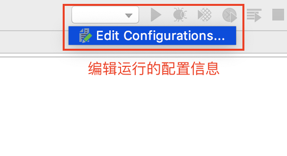
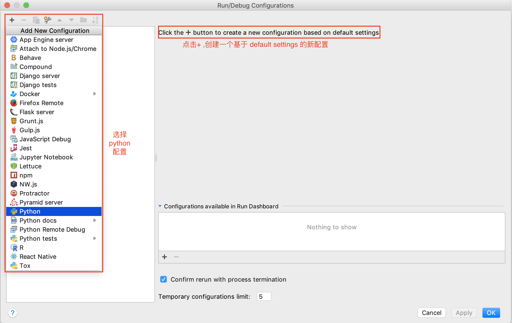
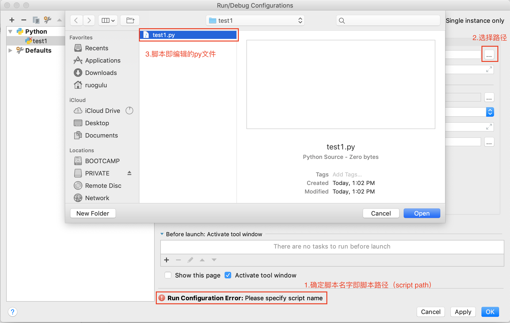
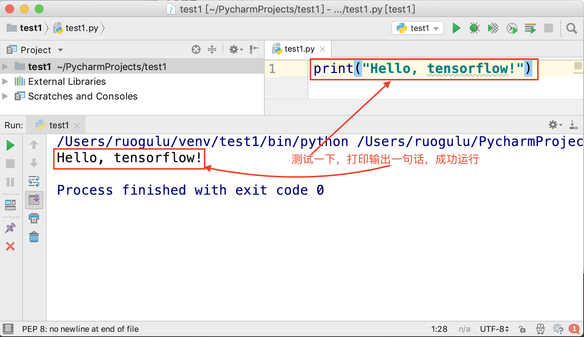

# Pycharm使用教程
## 1 常见问题（初级）
一. 使用Pycharm建立运行一个python程序  

1. `No interpreter` (解释器丢失)
	* please specify a different SDK name  
	[pycharm 报错：pycharm please specify a different SDK name](https://blog.csdn.net/lancegentry/article/details/79381047)  
2. `Select run/debug configuration` (选择run/debug的配置信息)
	* Edit Configuration  
	  
	<center>图1-1.编辑配置</center>
	
	* Create a new configuration  
	  
	<center>图1-2.创建配置</center>
	
	* Script path <font color=#FF0000 face="黑体">**[Script path作用是什么?](#Script Path的作用是什么)**</font>  
	
	<center>图1-3.脚本路径</center>
	
3. Test and Success (测试运行，试着打印一句话)  
	
	<center>图1-4.测试</center>

<div id="Script Path的作用是什么">二. Script Path的作用是什么？</div>  
&nbsp;&nbsp;&nbsp;&nbsp;&nbsp;&nbsp;&nbsp;Script即为脚本，类似于演戏时用到的脚本，script 其实就是一系列指令——演员看了指令就知道自己该表演什么，说什么台词；计算机看了指令就知道自己该做什么事情。所以 script 其实就是短小的、用来让计算机自动化完成一系列工作的程序，这类程序可以用文本编辑器修改，不需要编译，通常是解释运行的。而Python是解释性语言，也就是脚本，所以这里的```Script Path```（脚本路径）就是Python文件的路径。

三.解释器作用？  
&nbsp;&nbsp;&nbsp;&nbsp;&nbsp;&nbsp;&nbsp;解释器是一种计算机程序，能够把高端编程语言一行一行解释运行。解释器像是一位“中间人”，每次运行程序时都要先转成另一种语言再作运行，因此解释器的程序运行速度比较缓慢。  
&nbsp;&nbsp;&nbsp;&nbsp;&nbsp;&nbsp;&nbsp;解释器的好处是它消除了编译整个程序的负担，程序可以拆分成多个部分来模块化，但这会让运行时的效率打了折扣。相对地，编译器已一次将所有源代码翻译成另一种语言，如机器代码，运行时便无需再依赖编译器或额外的程序，故而其运行速度比较快。  
&nbsp;&nbsp;&nbsp;&nbsp;&nbsp;&nbsp;&nbsp;使用解释器来运行程序会比直接运行编译过的机器代码来得慢，但是相对的这个解释的行为会比编译再运行来得快。这在程序开发的雏型化阶段和只是撰写试验性的代码时尤其来得重要，因为这个“编辑-解释-调试”的循环通常比“编辑-编译-运行-调试”的循环来得省时许多。  
  
## 1.2 参考：
[1] Crossin.[你们要的 PyCharm 快速上手指南](https://zhuanlan.zhihu.com/p/26066151)  
[2] 涛吴.[如何用通俗易懂的语言解释脚本（script）是什么？](https://www.zhihu.com/question/19901542)  
[3] 邹雷.[将pycharm的运行配置脚本路径修改为当前选中文件](https://www.zoulei.net/2015/03/18/change-pycharm-run-configurations-script-path-to-current-file/) 

