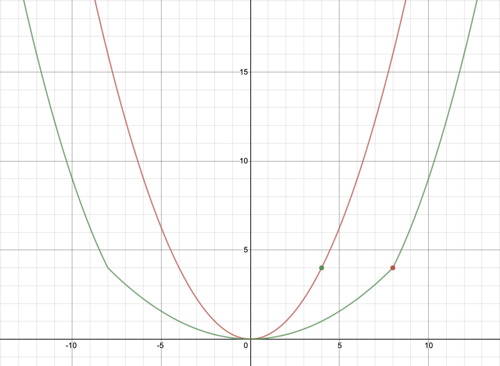
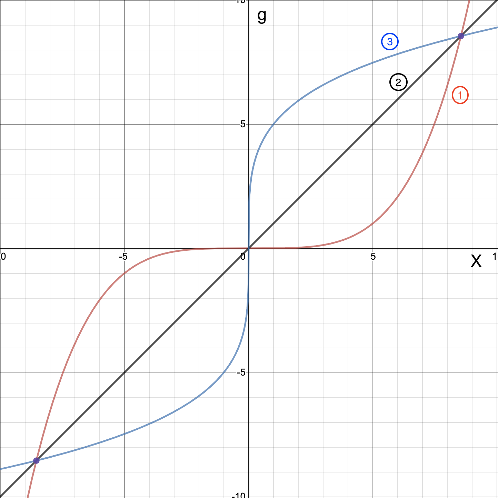

Table of Contents
=================

   * [第5章 牛顿法疑问](#第5章-牛顿法疑问)
      * [5.1 收敛性](#51-收敛性)
      * [5.2 正定性](#52-Positive)
      * [5.3 参考](#53-参考)

Created by [gh-md-toc](https://github.com/ekalinin/github-markdown-toc) 
# 

第5章 牛顿法疑问

&nbsp;&nbsp;&nbsp;&nbsp;&nbsp;&nbsp;&nbsp;续上一篇博客,对牛顿法当中的一些疑问进行简单粗浅的分析及总结。  
## 
5.1 收敛性
  
+ **问题细化：**  
&nbsp;&nbsp;&nbsp;&nbsp;&nbsp;&nbsp;&nbsp;牛顿法考虑二阶导数，求出海森矩阵，将一阶导除以二阶导作为新的改变量，这样收敛更快。但是一阶导除以二阶导后有可能导致一阶导变小，改变量不是变小了吗？下降不是减慢了吗？  

+ **图形角度**  
&nbsp;&nbsp;&nbsp;&nbsp;&nbsp;&nbsp;&nbsp;*以较为形象具体的形式对牛顿法收敛快进行解释。*  
&nbsp;&nbsp;&nbsp;&nbsp;&nbsp;&nbsp;&nbsp;通俗地讲，梯度下降仅考虑当前位置坡度最大的方向，而牛顿法不仅考虑坡度够大，还要考虑走出这一步后坡度是否够大。  
&nbsp;&nbsp;&nbsp;&nbsp;&nbsp;&nbsp;&nbsp;上面这句话很常见也很通俗，但似乎还不够清楚，下面将结合图的形式进行更加详细具体的解析。  
&nbsp;&nbsp;&nbsp;&nbsp;&nbsp;&nbsp;&nbsp;在研究该问题之前首先要明白一个大前提，海森矩阵必须是正定的，那么函数的梯度在求解范围内递增，进一步可以认为函数是一个凸函数，如下图所示：  

图 5-1.函数图
  
&nbsp;&nbsp;&nbsp;&nbsp;&nbsp;&nbsp;&nbsp;在上图中的两个函数在 $x>8$ 时具有相同的梯度，当 $x<8$ 时,红色曲线的收敛性将大于绿色曲线，为了早点到达极小值点，此时会选择红色曲线进行下降，这是对牛顿法将海森矩阵考虑在内的一种直观理解。  
&nbsp;&nbsp;&nbsp;&nbsp;&nbsp;&nbsp;&nbsp;用下图来表示梯度递增的几种形式，根据牛顿法在走出一步后梯度依然够大的要求，我们会选择3曲线所代表的曲线进行梯度的下降。有图易知，当梯度较大时（距离极小值点较远时），梯度的梯度（海森矩阵）的值较小，且小于1，所以式子$x_{k+1}=x_k-\frac{g_k}{H_k}$中$x_k$的改变量不是减小而是增大，体现了牛顿法收敛快的特点。而当梯度较小时，梯度的梯度反而较大，缩小了$x_k$的改变量，从而降低了在极值点处震荡的风险。
  

图 5-2.梯度变化图 
 
+ **理论角度**    
&nbsp;&nbsp;&nbsp;&nbsp;&nbsp;&nbsp;&nbsp;*根据一些已知结论或理论对牛顿法的合理性进行简单推导。*
&nbsp;&nbsp;&nbsp;&nbsp;&nbsp;&nbsp;&nbsp;牛顿法中引入了二阶导数，二阶导数会影响函数图像的下降方向和大小。二阶导数在几何当中的含义为曲率，代表几何体的弯曲程度，是该段曲线形成的圆半径的倒数，所以该二阶导数的变化趋势是递增。即对式子 $x_{k+1}=x_k-\frac{g_k}{H_k}$ 中的改变量进行调整，当远离极值点时加速下降，当靠近极值点则减缓下降。

>因为懒且学得渣，所以没用什么专业软件来画函数图像，而是用网站[desmos](https://www.desmos.com/calculator)来画函数图像，不是很强大但还是能满足一些简单要求的，推荐给各位看官。

 
## 
5.2 正定性
  
&nbsp;&nbsp;&nbsp;&nbsp;&nbsp;&nbsp;&nbsp;下文中的拟牛顿算法都指DFP算法，BFPG算法和DFP算法的原理是一样的，所以正定性的推导过程差不多，在此不做过多赘述了。
  
+ **问题细化：**  
&nbsp;&nbsp;&nbsp;&nbsp;&nbsp;&nbsp;&nbsp;拟牛顿法利用矩阵$G_k$来近似牛顿法中的海森矩阵或其逆矩阵，牛顿法中的海森矩阵要求正定，如何保证拟牛顿法中的替换矩阵$G_k$始终为正定？
+ **解决办法：** 
 1. 一般设定替换矩阵的初始矩阵为单位矩阵；
 2. 利用式子$G_{k+1}=G_k+\Delta G_k$对$G$进行迭代更新；
 3. 由于$G_{k+1}$是海森矩阵的近似，因此它满足式子$s_k=G_{k+1}y_k$且它是正定的；
 4. 在第三步中已经默认了$G_{K+1}$为正定，因此拟牛顿法中保证替换矩阵正定的问题转换为如下：
  
		> 求$G_k$的改变量$\Delta G_k$，从而保证$G_k$始终满足式子$s_k=G_{k+1}y_k$  
		
 5. 接下来利用“待定法”，我们不知道$\Delta G_k$到底是什么，但我们可以先将其待定为$\Delta G_k=\alpha uu^T+\beta vv^T$，其中$u$和$v$都是n维向量(n行1列)；

 	   > **个人理解：**假设$\Delta D_k=\alpha uu^T+\beta vv^T$的原因是矩阵加法必须满足两个矩阵行数列数相等。y式子$s_k=G_{k+1} y_k$易知$G_k$应该是一个n阶方阵，所以$\Delta D_k$一定是一个n阶矩阵，通过上面的假设可以很容易保证$G_k$是n阶矩阵并且还是对称矩阵，在计算求解方面更加方便。  
 	   
 6. 将$\Delta G_k$的表达式代入拟牛顿条件中，从而逆推出$\Delta G_k$的值；  
 
      >拟牛顿条件改变为
      $$
      \begin{aligned}
      s_k &= G_k y_k+\alpha uu^Ty_k+\beta vv^Ty_k\\
      	   &= G_k y_k+ (\alpha u^Ty_k)u+(\beta v^Ty_k)v
      \end{aligned}\tag{1.1}
      $$
      易知，$\alpha u^Ty_k$和$\beta v^Ty_k$是两个数，因此我们不妨作简单赋值  
      
$$\alpha u^Ty_k=1, \beta v^Ty_k=-1 \tag{1.2}$$

      可以得，  
      
$$\alpha=\frac{1}{u^Ty_k}, \beta=\frac{-1}{v^Ty_k}\tag{1.3}$$

      将式子(1.2)代入式子(1.1)，  
      
$$
      \begin{aligned}  
      s_k-G_k y_k=u-v
      \end{aligned}
      $$

      得，  
      $$
      u=s_k,v=G_k y_k
      $$  
      此时可以求得$\Delta D_k$的值如下，  
      $$
      \Delta G_k=\frac{s_k^T s_k}{s_k^T y_k}-\frac{G_k y_k^T  y_k G_k}{y_k^T G_k y_k}
      $$
 7. 推导完毕。          

## 
5.3 参考
 
**为什么牛顿法收敛快：**  
[1] 大饼土博.[最优化问题中，牛顿法为什么比梯度下降法求解需要的迭代次数更少？](https://www.zhihu.com/question/19723347)  
**画函数图像的网站：**  
[1].[desmos](https://www.desmos.com/calculator)  
**如何保证拟牛顿正定性**   
[1] 皮果提.[牛顿法与拟牛顿法学习笔记（二）拟牛顿条件](https://blog.csdn.net/itplus/article/details/21896981)  
[2] liuwu265.[拟牛顿法 分析与推导](https://www.cnblogs.com/liuwu265/p/4714396.html)  
[3] 皮果提.[牛顿法与拟牛顿法学习笔记（三）DFP 算法](https://blog.csdn.net/itplus/article/details/21896981)

