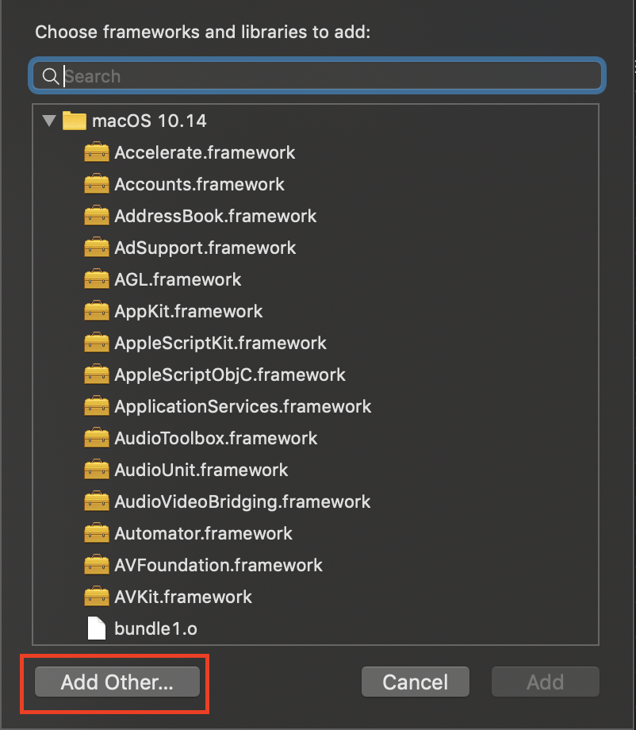

# <center>人脸识别（二）</center>
代码开始前的准备工作
--------
&nbsp;&nbsp;&nbsp;&nbsp;&nbsp;&nbsp;&nbsp;在进行人脸识别项目前需先进行如下准备工作，否则会报错，带来不必要的烦恼：  

+ 下载安装opencv3；  
+ 导入opencv3；
+ 检查xml文档；  
+ 开启本地摄像头；

系统：Mac；  
开发环境（IDE）：Xcode；  
开发语言：C++；  
&nbsp;&nbsp;&nbsp;&nbsp;&nbsp;&nbsp;&nbsp;关于Python的计算机视觉项目，网上有很多资料可以参考，如Satya这位大牛的博客 [Install OpenCV 3 on MacOS](https://www.learnopencv.com/install-opencv3-on-macos/) 就非常详尽，尽管是英文，装个翻译插件，基本还是可以看懂的。

## 2.1 Install OpenCV 3 
&nbsp;&nbsp;&nbsp;&nbsp;&nbsp;&nbsp;&nbsp;Opencv是著名的跨平台计算机视觉开源库,是进行计算机视觉项目学习的基石。OpenCV共有三个版本，最新版本为OpenCV3，本文也将主要围绕该版本进行研究。  
&nbsp;&nbsp;&nbsp;&nbsp;&nbsp;&nbsp;&nbsp;此次安装是在Mac系统下进行：
  
+ 安装Homebrew  
``$ brew update``。   
*Homebrew 是一套软件包管理系统，简化macOS上的软件安装过程。*
+ 安装过python2和python3,  
若之前未曾安装，则进行安装  

````  
$ brew install python python3
$ brew link python
$ brew link python3 
````
&nbsp;&nbsp;&nbsp;&nbsp;&nbsp;&nbsp;&nbsp;若非第一次安装则直接进行更新  

````
$ brew upgrade python
$ brew upgrade python3
````
&nbsp;&nbsp;&nbsp;&nbsp;&nbsp;&nbsp;&nbsp;安装更新完毕后需检查python是否成功安装及其路径
  
````
which python2  # 应该输出 /usr/local/bin/python2  
which python3  # 应该输出 /usr/local/bin/python3  
````  

+ 通过Homebrew安装OpenCV  
````
brew install opencv
````  
*Homebrew目前有一些修改，将一些常用命令添加入homebrew-core。之前是用``opencv``安装OpenCV 2，``opencv3``安装OpenCV 3。目前则改为OpenCV 3使用``opencv3``，而OpenCV 2使用``opencv@2`` 来安装。*

+ 安装完毕后可以查看opencv的安装路径,目录``/usr/local/Cellar``下会出现一个文件夹``opencv``，这就是安装的opencv，记住这个路径，之后配置中会多次用到。
  
## 2.2 导入OpenCV 3  
&nbsp;&nbsp;&nbsp;&nbsp;&nbsp;&nbsp;&nbsp;安装完OpenCV 3后还无法在代码中直接使用这个库，因为还需要将其导入项目当中。即还需要在编译器进行路径的配置，及相关文件的添加：

+ 点击Xcode项目—>选择``Build Settings``—>搜索``Search``->如图所示导入opencv路径和库路径，详情见下图：  
  
+ 再选择``Build Phases``—>导入opencv动态库文件（都以libopencv开头切在同一文件夹中），详情见下图：  

&nbsp;&nbsp;&nbsp;&nbsp;&nbsp;&nbsp;&nbsp;上图所示是已经导入动态库后的截图， 未导入时显示为空。 
  
  
  
## 2.3 导入xml文件  
&nbsp;&nbsp;&nbsp;&nbsp;&nbsp;&nbsp;&nbsp;xml文件一般就在OpenCV文件夹下，具体路径如代码中所示``/usr/local/Cellar/opencv/3.4.1_3/share/OpenCV/haarcascades/haarcascade_frontalface_default.xml``。  

&nbsp;&nbsp;&nbsp;&nbsp;&nbsp;&nbsp;&nbsp;当以上步骤完成后，将包含有``capture``的代码注释掉，此时代码可以初步实现对本地图片的人脸识别。  

## 2.4 开启摄像头  
&nbsp;&nbsp;&nbsp;&nbsp;&nbsp;&nbsp;&nbsp;Windows系统好像是不需要这一步的，而Mac系统是需要赋予程序访问摄像头的权限，否则报错

````  
This app has crashed because it attempted to  access  
privacy-sensitive data without a usage  description.  
The app's Info.plist must contain an  
NSCameraUsageDescription key with a string value. 
explaining to the user how the app uses this data.
````  
&nbsp;&nbsp;&nbsp;&nbsp;&nbsp;&nbsp;&nbsp;要为程序赋予访问摄像头的权限，只需添加info.plist文件，具体操作如下：

+ 右键Xcode项目名称—>new file；  
+ 创建Property List文件，并将其命名为``info``；  
  

+ 右键``info.plist``—>``Open As``—>``Property List``，填入下图所示内容；  
  
  
&nbsp;&nbsp;&nbsp;&nbsp;&nbsp;&nbsp;&nbsp;最后将创建好的info.plist文件拖入Products文件夹中，此时摄像头应该就可以打开了，如果打不开就重启一次Xcode并运行代码。  

## 2.5 Reference
[Opencv3.2各个模块功能详细简介（包括与Opencv2.4的区别)](https://blog.csdn.net/zmdsjtu/article/details/54924727)