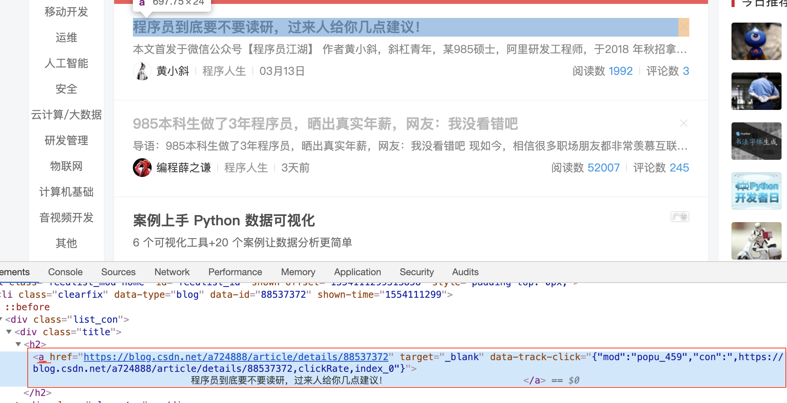

# <center>流程（Process）</center>
在实践爬取网页数据时的流程概述，github中观看效果不太好，欢迎访问我的博客[Process of CrawlingBlog](https://blog.csdn.net/lrglgy/article/details/88937528)，获得更好阅读体验。
## 1.1 前言
&nbsp;&nbsp;&nbsp;&nbsp;&nbsp;&nbsp;&nbsp;在看Youtube时， 发现Youtube频道是可以赚钱的，只要自己Youtube频道的观看订阅人数够多，就可以通过投放广告来赚钱。于是自己也异想天开通过Youtube频道赚钱，但又不知哪种类型的频道最为赚钱，于是便想利用自身所学来分析一下Youtube频道的数据，从而做出明智的决定。尝试初期发现Youtube的数据格式不是那么规整，不太好爬取所以先用csdn博客来练练手。  
&nbsp;&nbsp;&nbsp;&nbsp;&nbsp;&nbsp;&nbsp;之前从未接触过python爬取网站数据，所以也相当于半个小白，而我的过程也应该非常适合对爬虫感兴趣且无太多经验的小白来看。  
&nbsp;&nbsp;&nbsp;&nbsp;&nbsp;&nbsp;&nbsp;文章个人感觉很长，只想玩玩爬虫的可以直接跳到最后拷贝复制运行代码。个人实践当中发现有时会报错如

+ ``urllib2.HTTPError: HTTP Error 403: Forbidden``
+ ``IncompleteRead(81552 bytes read, 14206 more expected)``  

出现以上两种两种报错时，一般再运行一遍程序就不会报错了，也就是说以上两种报错是偶发性的。后续博客会将我实践当中遇到并解决的报错进行总结，欢迎持续关注我的博客。
## 1.2 目的
&nbsp;&nbsp;&nbsp;&nbsp;&nbsp;&nbsp;&nbsp;获取csdn前n页的热门博客的标题，链接，阅读量，评论量，并将这些数据存储到Excel表格当中。
## 1.3 开发工具及环境
+ 开发工具：Pycharm  
&nbsp;&nbsp;&nbsp;&nbsp;&nbsp;&nbsp;&nbsp;我使用的是Pycharm Professional(Pycharm 专业版)，对于爬取网站数据这样的小项目，专业版和社区版之间无差别。  
&nbsp;&nbsp;&nbsp;&nbsp;&nbsp;&nbsp;&nbsp;专业版与社区版的具体差别，有强烈求知欲和强迫症的朋友可以看这里[Pycharm的教育版和社区版有什么区别](https://www.zhihu.com/question/47511825/answer/116663493)，我建议还是别看了，免得分散精力。
+ 环境： Python 3.6  
&nbsp;&nbsp;&nbsp;&nbsp;&nbsp;&nbsp;&nbsp;建议尽量用Python 3.0 以后的版本，毕竟python 3比较新，越来越多的开发都使用python 3。除此之外，python 3中有些库和python 2有些不同，本文中的代码是在python 3下实现，放在python 2下一定会出错（**亲生体验，血的教训**）。
+ 系统： Mac OS Mojave 10.14.4  
&nbsp;&nbsp;&nbsp;&nbsp;&nbsp;&nbsp;&nbsp;既然python是跨平台的，所以无论是Mac还是Windows都一样，无需赘言。
+ 更详细的配置信息见下图：  
 
 
## 1.4 功能模块化及实现
&nbsp;&nbsp;&nbsp;&nbsp;&nbsp;&nbsp;&nbsp;要实现csdn博客信息获取，其功能可粗略划分为如下四个：  

+ 实现遍历csdn的每一个页面；
+ 分析网页编码并进行解码；
+ 获取当前页面中热门博客标题，链接，作者等信息；
+ 将获取到的信息保存入Excel表格中。

### 1.4.1 遍历CSDN若干页面
&nbsp;&nbsp;&nbsp;&nbsp;&nbsp;&nbsp;&nbsp;通过观察得，csdn网站是由一个个页面组成，而每个页面是由博客标题，作者，阅读量，广告等组成。所以在获取博客标题，作者等信息前要先遍历访问每一个页面。通过观察得知，页面url之间只是``page=**``不一样，所以我们可以考虑通过循环并改变page对应的值来遍历所有页面。代码如下：

````
def url_all():  
	for page in range(1,3):
       url = "https://www.csdn.net/?toolbar_logo&page="+str(page)
       print("将第"+str(page)+"页加入列表url_list")
       url_list.append(url)
````
### 1.4.2 进行网页编码与解码
&nbsp;&nbsp;&nbsp;&nbsp;&nbsp;&nbsp;&nbsp;字符串在Python内部的表示是unicode编码，因此，在做编码转换时，通常需要以unicode作为中间编码，即先将其他编码的字符串解码（decode）成unicode，再从unicode编码（encode）成另一种编码。可以使用模块chardet对网页编码进行解析，根据解析结果将网页编码转换，再进行解码。更详细内容可参考博客[
Python中的编码（encode）与解码（decode）](https://blog.csdn.net/Xw_Classmate/article/details/51934723)。
详细代码如下：  

````
def Trans_code(blog_url):
        response = request.urlopen(blog_url)
        html = response.read()
        # 进行编码转换与解码,利用模块chardet可以方便检测网页编码
        charset = chardet.detect(html)
        # 将网页编码转换为str,再进行解码
        html = html.decode(str(charset["encoding"]))
        return html
````
&nbsp;&nbsp;&nbsp;&nbsp;&nbsp;&nbsp;&nbsp;最后得到的html是Unicode编码的网页。
### 1.4.3 获取数据
&nbsp;&nbsp;&nbsp;&nbsp;&nbsp;&nbsp;&nbsp;获取所有由Unicode编码的网页的数据后，我们需要从中提取感兴趣的数据。这里我使用了python中重要的从html文档中提取数据的库Beautiful Soup。关于Beautiful Soup库的详细解释可参考这篇博客[Python爬虫利器二之Beautiful Soup的用法](https://cuiqingcai.com/1319.html)。  
&nbsp;&nbsp;&nbsp;&nbsp;&nbsp;&nbsp;&nbsp;在使用Beautiful库提取数据时，本文采取了css选择器即方法``select()``。在向``select()``中填入内容前需先查看网页源码确定要提取数据的位置，网页源码见下图。由图可见，需要获取的数据都在类名``class="list_con"``所包含的内容中。通过遍历找出所有``class="list_con"``包含的内容。然后分别找到标题对应的标签``<a>``，博客链接位置为标签``<a>``对应的属性``href``，博客作者位置为``class="name"``，博客阅读数位置为``class="num"``。

<center>获取标题</center>

<center>获取作者</center>

<center>获取阅读量</center>

&nbsp;&nbsp;&nbsp;&nbsp;&nbsp;&nbsp;&nbsp;在查找数据位置当中，在方法``select()``中填入的内容为个人不断尝试得出。本文中尝试方法就是将填充内容更换为离目标数据最近的标签名或类名或属性名，然后观察输出结果，最终确定正确的填充内容。个人总结的关于填入正确查找位置的经验为：

+ 先查找距离目标数据最近的标签名或类名或id名或组合或属性；
+ 然后观察标签名或类名或id名或组合或属性等信息是否第一次出现，如果是则采用，如果不是再选取剩余信息。

&nbsp;&nbsp;&nbsp;&nbsp;&nbsp;&nbsp;&nbsp;详细代码如下：

````python
def Get_data(html):
    soup = BeautifulSoup(html, 'html.parser')
    # 获取到每一个class=list_con的a节点
    allList = soup.select('.list_con')
    # 遍历列表，获取有效信息
    # print("网页链接为:", url)
    print("网页链接为:", blog_url)
    for news in allList:
        number = news.select('.num')
        author = news.select('.name')
        eassy_title = news.select('a')
        # 只选择长度大于0的结果
        # print("从a节点获取的信息:\n",eassy_title)
        if len(eassy_title) > 0:
            # 文章链接
            try:  # 如果抛出异常就代表为空
                href = eassy_title[0]['href']
                #   href = url + aaa[0]['href']
                X.append(href)
            except Exception:
                href = '链接为空'
            # 博客标题
            try:
                # title = aaa[0]['title']
                title = eassy_title[0].text
                Y.append(title)
            except Exception:
                title = "标题为空"
            # 博客阅读数
            try:
                readnum = number[0].text
                Z.append(readnum)
            except Exception:
                readnum = "未知阅读数"
            # 博客作者
            try:
                who = author[0].text
                A.append(who)
            except Exception:
                who = "无名氏"
            print("标题", title, "\nurl：", href, "\n阅读量：", readnum, "\n作者：", who)

````

**题外话（慎看）**：   
&nbsp;&nbsp;&nbsp;&nbsp;&nbsp;&nbsp;&nbsp;有兴趣深入研究css选择器者可将之与搜索文档树即方法``find_all()``对比学习，参考文档同为[Python爬虫利器二之Beautiful Soup的用法](https://cuiqingcai.com/1319.html)。  
&nbsp;&nbsp;&nbsp;&nbsp;&nbsp;&nbsp;&nbsp;在浏览有关网页中数据爬取的资料时，发现获取网页数据除了可以调用库Beautiful Soup库外，还可以用正则表达式，lxml。有兴趣深入研究者可查看博客[python抓取网页数据的三种方法](https://juejin.im/entry/5a8fcfb4f265da4e9b592780)。  
### 1.4.4 导出数据
&nbsp;&nbsp;&nbsp;&nbsp;&nbsp;&nbsp;&nbsp;获取到的数据需要保存至本地``.csv``文件。由于获取的数据是标签型数据（如HTML，XML，JSON，YAML等），而标签型数据无法直接存入``.csv``表格当中，所以要通过``.string``或``.text``获取标签内部的文字（即cotent, NavigableString对象），然后将获得的NavigableString对象存入列表当中。将列表转换为字典，再将结果转换为``DataFrame``，最后存入表格当中。在将数据存入表格时需要设置编码方式``encoding='gbk'``,否则保存的数据会显示乱码。
详细代码如下：

````python
def Save_data(X,Y,Z,A):
    print("储存数据至表格.......")
    Table = {"Title": Y, "ReadNumber": Z, "Author": A, "URL": X}
    df = pd.DataFrame(Table)
    df.to_csv('Table.csv', encoding='gbk')
    print("==============================================================================================")
````
## 1.5 原始代码

````python
import ssl
from bs4 import BeautifulSoup
from urllib import request
import chardet
import xlwt
import pandas as pd

ssl._create_default_https_context = ssl._create_unverified_context

def url_all():
   for page in range(1,3):
       url = "https://www.csdn.net/?toolbar_logo&page="+str(page)
       print("将第"+str(page)+"页加入列表url_list")
       url_list.append(url)

def Trans_code(blog_url):
        response = request.urlopen(blog_url)
        html = response.read()
        # 进行编码转换与解码,利用模块chardet可以方便检测网页编码
        charset = chardet.detect(html)
        # 将网页编码转换为str,再进行解码
        html = html.decode(str(charset["encoding"]))
        return html

def Get_data(html):
    soup = BeautifulSoup(html, 'html.parser')
    # 获取到每一个class=list_con的a节点
    allList = soup.select('.list_con')
    # 遍历列表，获取有效信息
    print("网页链接为:", blog_url)
    for news in allList:
    	number = news.select('.num')
        author = news.select('.name')
        eassy_title = news.select('a')
        # 只选择长度大于0的结果
        # print("从a节点获取的信息:\n",eassy_title)
        if len(eassy_title) > 0:
            # 文章链接
            try:  # 如果抛出异常就代表为空
                href = eassy_title[0]['href'）
                X.append(href)
            except Exception:
                href = '链接为空'
            # 博客标题
            try:
                # title = aaa[0]['title']
                title = eassy_title[0].text
                Y.append(title)
            except Exception:
                title = "标题为空"
            # 博客阅读数
            try:
                readnum = number[0].text
                Z.append(readnum)
            except Exception:
                readnum = "未知阅读数"
            # 博客作者
            try:
                who = author[0].text
                A.append(who)
            except Exception:
                who = "无名氏"
            print("标题", title, "\nurl：", href, "\n阅读量：", readnum, "\n作者：", who)
      
def Save_data(X,Y,Z,A):
    print("储存数据至表格.......")
    Table = {"Title": Y, "ReadNumber": Z, "Author": A, "URL": X}
    df = pd.DataFrame(Table)
    df.to_csv('Table.csv', encoding='gbk')
    print("==============================================================================================")

\# --------------------------主程序---------------------------             
X = [] # X储存所有链接
Y = [] # Y储存所有标题
Z = [] # Z储存所有阅读数
A = [] # A储存所有作者
url_list = []
url_all()
for blog_url in url_list:
	html = Trans_code(blog_url)
	Get_data(html)
Save_data(X,Y,Z,A)
````
&nbsp;&nbsp;&nbsp;&nbsp;&nbsp;&nbsp;&nbsp;本文代码在实践中多次修改，有些改动可能并未及时同步到上述代码中，有可能出现报错的情况，由于代码版本过多，且精力不够，我将已验证正确的代码上传至[github](https://github.com/Roggu123/Algorithm/blob/master/Practice/Data/CrawlingBlog/CrawlingBlog.py),如果文中代码运行通不过或希望查看更多版本的代码，可访问我的github。
## 1.6 参考
    
[网页编码就是那点事（ ANSI、GBK、GB2312、UTF-8、GB18030和 UNICODE）](https://blog.csdn.net/tinyletero/article/details/8197974)  
有关报错的解释 [UnicodeEncodeError: 'gbk' codec can't encode character: illegal multibyte sequence](https://stackoverflow.com/questions/3218014/unicodeencodeerror-gbk-codec-cant-encode-character-illegal-multibyte-sequen)  
编码（encode）时添加 'ignore'[【已解决】UnicodeEncodeError: ‘gbk’ codec can’t encode character u’\u200e’ in position 43: illegal multibyte sequence](https://www.crifan.com/unicodeencodeerror_gbk_codec_can_not_encode_character_in_position_illegal_multibyte_sequence/)  
在设置（setting）中更改 [pycharm中python编码问题解决](https://blog.csdn.net/peade/article/details/46841803)  
df输出正确但导出csv后乱码 [python csv 格式文件 中文乱码问题解决方法](https://blog.csdn.net/glory1234work2115/article/details/53913951)  
python中request模块及不同版本对比[Python中的urllib.request模块](https://blog.csdn.net/Jurbo/article/details/52313636)  
网页编码与解码[Python中的编码（encode）与解码（decode）](https://blog.csdn.net/Xw_Classmate/article/details/51934723)  
chardet解析[chardet](https://www.liaoxuefeng.com/wiki/0014316089557264a6b348958f449949df42a6d3a2e542c000/001510905171877ca6fdf08614e446e835ea5d9bce75cf5000)  
Beautiful Soup库 [Python爬虫利器二之Beautiful Soup的用法](https://cuiqingcai.com/1319.html)  
python中数据读取与存储 [Python数据处理 I：数据的读取与存储](https://zhuanlan.zhihu.com/p/33085521)
