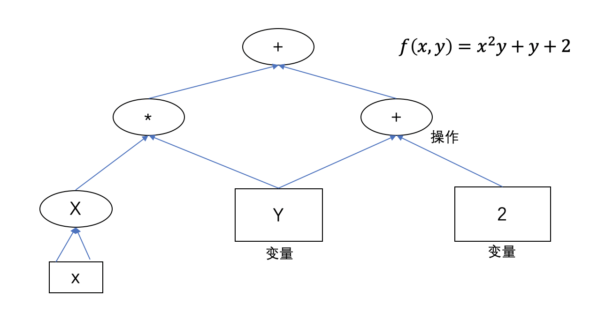

Table of Contents
=================

   * [Anaconda学习记录](#anaconda学习记录)
      * [1.1 Anaconda简介](#11-anaconda简介)
         * [1.1.1 Anaconda、conda、pip、virtualenv的区别](#111-anacondacondapipvirtualenv的区别)
      * [1.2 Anaconda安装Tensorflow](#12-anaconda安装tensorflow)
         * [1.2.1 安装Anaconda](#121-安装anaconda)
         * [1.2.2 在Anaconda中激活安装tensorflow](#122-在Anaconda中激活安装tensorflow)
         * [1.2.3 在tensorflow中安装Jupyter Notebook](#123-在tensorflow中激活安装jupyter-notebook)
         * [1.2.4 在terminal中运行Tensorflow](#124-在terminal中运行tensorflow)
         * [1.2.5 在jupyter notebook中运行tensorflow](#125-在jupyter-notebook中运行tensorflow)
         * [1.2.6 报错解决](#126-报错解决)  
           
      * [1.3 Tensorflow使用](#13-tensorflow使用)  
         * [1.3.1 创建图](#131-创建图)
         * [1.3.2 执行图](#132-执行图)  
         * [1.3.3 管理图](#133-管理图)
         * [1.3.4 节点生命周期](#134-节点生命周期)  
         * [1.3.4 归一化](#135-归一化)
         * [1.3.6 简单线性回归](#136-简单线性回归)
         * [1.3.7 梯度下降](#137-梯度下降)  
         
      * [1.4 参考](#14-参考)

# Anaconda学习记录
学习使用Anaconda
  
## <div id="11-anaconda简介">1.1 Anaconda简介</div>
>由于Python具有数量庞大的库，因此管理这些库以及对库作及时的维护成为既重要但复杂度又高的事情。Anaconda[（官方网站）](https://www.anaconda.com/distribution/#macos)就是可以便捷获取包且对包能够进行管理，同时对环境可以统一管理的发行版本。Anaconda包含了conda、Python在内的超过180个科学包及其依赖项。
>
  
参考自[Anaconda介绍、安装及使用教程](https://zhuanlan.zhihu.com/p/32925500) 

### <div id="111-anacondacondapipvirtualenv的区别">1.1.1 Anaconda、conda、pip、virtualenv的区别</div>
 
+ Anaconda，Docker 和 Virtualenv都可以用来安装使用 tensorflow,那它们的区别是什么呢？  
&nbsp;&nbsp;&nbsp;&nbsp;&nbsp;&nbsp;&nbsp;Anaconda是可以便捷**获取包**且对**包**能够进行**管理**，同时对**环境**可以统一**管理**的python发行版本；  
&nbsp;&nbsp;&nbsp;&nbsp;&nbsp;&nbsp;&nbsp;Docker可以理解为**集装箱**，其中包含应用需要的**环境**及服务，并且保证各集装箱的环境互不影响；  
&nbsp;&nbsp;&nbsp;&nbsp;&nbsp;&nbsp;&nbsp;Virtualenv则是用于**创建**一个独立的Python**环境的工具**。
  
+ conda和pip都可以安装包，它们的区别是什么？  
&nbsp;&nbsp;&nbsp;&nbsp;&nbsp;&nbsp;&nbsp;conda除了是包安装工具外，还可以对**环境**进行**管理**，与Docker类似；  
&nbsp;&nbsp;&nbsp;&nbsp;&nbsp;&nbsp;&nbsp;pip是用于安装和管理软件包的包管理器。
 
## <div id="12-anaconda安装tensorflow">1.2 Anaconda安装Tensorflow</div>
### <div id="121-安装anaconda">1.2.1 安装Anaconda</div>     
&nbsp;&nbsp;&nbsp;&nbsp;&nbsp;&nbsp;&nbsp;可以采取图形界面及终端命令方式安装，详见参考文献[Anaconda介绍、安装及使用教程](https://zhuanlan.zhihu.com/p/32925500)。安装完毕后可通过命令```conda --version```查看Anaconda版本并进行更新```conda update conda```,详情见如下：  
  
<center>图2-1.安装Anaconda</center>
### <div id="122-122-在Anaconda中激活安装tensorflow">1.2.2 在Anaconda中激活安装tensorflow</div>
&nbsp;&nbsp;&nbsp;&nbsp;&nbsp;&nbsp;&nbsp;安装Anaconda后需在其中创建一名为Tensorflow的环境，输入`$ conda create -n tensorflow python=3.5`。此时Anaconda中的Enviroment中会有一个Tensorflow环境，如下图所示：  

<center>图2-2.创建tensorflow环境</center> 
&nbsp;&nbsp;&nbsp;&nbsp;&nbsp;&nbsp;&nbsp;目前只安装了一个空的环境，仅有与Python3.5相关的一些包，我们要激活环境并安装，输入命令：
`
source activate tensorflow
`，  
然后安装tensorflow包，输入命令：  
`pip install tensorflow`，  
详情如下：  
  
<center>图2-3.激活Tensorflow环境</center>  
安装完毕后输入命令```python```并在终端中输入如下代码测试：

 > import tensorflow as tf  
 > hello = tf.constant('Hello, TensorFlow!')  
 > sess = tf.Session()  
 > print(sess.run(hello))	
  
 详情如下：  

<center>图2-4.检查安装</center>

### <div id="123-在tensorflow中安装jupyter-notebook">1.2.3 在tensorflow中安装Jupyter Notebook</div>
&nbsp;&nbsp;&nbsp;&nbsp;&nbsp;&nbsp;&nbsp;Jupyter Notebook是基于网页的用于交互计算的应用程序。其可被应用于全过程计算：开发、文档编写、运行代码和展示结果。个人理解就是一个功能较为丰富的代码编辑器。  
&nbsp;&nbsp;&nbsp;&nbsp;&nbsp;&nbsp;&nbsp;因为前面已安装了Anaconda，所以此时可以直接在Anaconda界面中选择Jupyter Notebook进行安装。但是此时只是在Anaconda中安装了Jupyter Notebook，还不能将其应用于Tensorflow环境（即打开Jupyter无法使用tensorflow），所以我们还要在Tensorflow环境中安装Jupyter Notebook，安装详情如下：  
  
<center>图2-5.安装Jypyter(Tensorflow)</center>
  
### <div id="124-在terminal中运行tensorflow">1.2.4 在terminal中运行Tensorflow</div>  
&nbsp;&nbsp;&nbsp;&nbsp;&nbsp;&nbsp;&nbsp;见步骤[2](#2)或在terminal中打开Jupyter Notebook,在Jupyter notebook中运行Tensorflow，详情见下图：  
  
<center>图2-6.终端打开Jupyter Notebook</center>

### <div id="125-在jupyter-notebook中运行tensorflow">1.2.5 在jupyter notebook中运行tensorflow</div>  
&nbsp;&nbsp;&nbsp;&nbsp;&nbsp;&nbsp;&nbsp;在图形界面中开启jupyter notebook,详情如下：  
  
<center>图2-5.打开Anaconda</center>  
  
<center>图2-6.新建代码文件</center>  
	 
### <div id="126-报错解决">1.2.6 报错解决</div>
&nbsp;&nbsp;&nbsp;&nbsp;&nbsp;&nbsp;&nbsp;在jupyter notebook 中编写并运行文件时可能会报错`无法导入某个包`：  
**解决办法一：**  
&nbsp;&nbsp;&nbsp;&nbsp;&nbsp;&nbsp;&nbsp;可能是由于没有在Tensorflow环境中安装Jupyter Notebook，参照[第3步](#在tensorflow中安装Jupyter Notebook)进行操作。    
**解决办法二：**  
&nbsp;&nbsp;&nbsp;&nbsp;&nbsp;&nbsp;&nbsp;可以在 Anaconda Navigator 界面中选择 Enviroment 并选择对应的编程环境，查找并安装相应的包。详情如下： 

<center>图2-7.安装对应包</center>  
**解决办法三：**  
&nbsp;&nbsp;&nbsp;&nbsp;&nbsp;&nbsp;&nbsp;在环境界面显示已安装了对应包，可还是报错时（我遇到的情况是`no moduled named tensorflow`，即没有tensorflow模块），可以尝试对`pip`更新
`$ pip install --upgrade pip Collecting pip`  
或重新通过`pip`安装`tensorflow`  
`$ pip install tensorflow`。

## <div id="13-tensorflow使用">1.3 TensorFlow使用</div>  
&nbsp;&nbsp;&nbsp;&nbsp;&nbsp;&nbsp;&nbsp;完成[TensorFlow的安装]()后，终于可以进行TensorFlow的初步体验。文中所示代码都是在JupyterNotebook中输入且验证无误。
### <div id="131-创建图">1.3.1 创建图</div>  
&nbsp;&nbsp;&nbsp;&nbsp;&nbsp;&nbsp;&nbsp;在TensorFlow中的计算图如下所示：  
  
<center>图3-1.计算图</center>  
&nbsp;&nbsp;&nbsp;&nbsp;&nbsp;&nbsp;&nbsp;创建计算图即定义了一系列用来计算的节点，据图3-1创建计算图的代码如下：

```python
import tensorflow as tf  
x = tf.Variable(3, name="x")  
y = tf.Variable(4, name="y")  
f = x*x*y+y+2
```
  
&nbsp;&nbsp;&nbsp;&nbsp;&nbsp;&nbsp;&nbsp;计算图不仅可以用来隔离张量和计算，它还提供了管理张量和计算的机制。  
### <div id="132-执行图">1.3.2 执行图</div>  
&nbsp;&nbsp;&nbsp;&nbsp;&nbsp;&nbsp;&nbsp;尽管在上一节中创建了计算图，但它并没有执行任何计算，甚至连变量都没有初始化。需要打开一个TensorFlow会话来初始化变量并执行计算图。一个TensorFlow会话会将计算分发到CPU和GPU等设备上并执行。打开会话并执行计算图的方式如下：  

1. 最为直接简单的方式是创建一个会话，初始化所有变量，求值，关闭会话（释放资源），代码如下：  

 ```python
sess = tf.Session()
sess.run(x.initializer)
sess.run(y.initializer)
result = sess.run(f)
print(result)   #输出为42
sess.close()
```
上述方式每次都要重复`sess.run`，而这种方式的缺点在于：代码复杂，重复执行图导致重复求值（具体见节点生命周期）。

2. 通过调用with块创建默认会话，代码如下：
  
 ```python
with tf.Session() as sess:  
       x.initializer.run()
       y.initializer.run()
       result = f.eval()
print(result)  #输出为42
 ```   
上述方式用`x.initializer.run`和`f.eval`分别替换`sess.run(f)`和`sess.run(x)`，这种写法不仅增加了代码可读性还可让会话在块中代码执行结束后自动关闭。  
代码`x.initializer.run`依然被重复了一次，可以再创建一个节点，在会话执行前初始化所有变量，代码如下：  

  ```python
init = tf.global_variables_initializer()  #添加节点
with tf.Session() as sess:  
      init.run()  
      result = f.eval()
print(result)  #输出为42
  ```  

3. 通过`InteractiveSession()`创建默认会话，代码如下：  

 ```python
 sess = tf.InteractiveSession()
init.run()  #由于第2步中创建了初始化节点，所以这里可以直接用init.run()
result = f.eval()
print(result)  
sess.close()
 ```
 
&nbsp;&nbsp;&nbsp;&nbsp;&nbsp;&nbsp;&nbsp;由上述各种方法可知，一个TensorFlow程序通常分为两部分：第一部分用来构建一个计算图（构建阶段），第二部分则用来执行这个图（执行阶段）。构建阶段利用计算图来展示机器学习模型及训练所需的计算。而执行阶段则重复执行训练动作，逐步提升模型参数。  

### <div id="133-管理图">1.3.3 管理图</div>  
&nbsp;&nbsp;&nbsp;&nbsp;&nbsp;&nbsp;&nbsp;在TensorFlow中创建的所有节点都会自动添加到默认图上，检验如下：  

```python
x1 = tf.Variable(1)
x1.graph is tf.get_default_graph()  # 结果显示为TRUE
```  

&nbsp;&nbsp;&nbsp;&nbsp;&nbsp;&nbsp;&nbsp;有时需要将节点添加到不同的计算图当中，可以用with块将目标计算图设置为默认图并添加，代码如下：  

```python
graph = tf.Graph()
with graph.as_default():
    x2 = tf.Variable(3)
x2.graph is graph  # 结果显示为TRUE
x2.graph is tf.get_default_graph()  # 结果显示为FALSE
```  

### <div id="134-节点生命周期">1.3.4 节点生命周期</div>  
### <div id="135-归一化">1.3.5 归一化</div>
+ 调用sklearn中的StandardScaler类对数据进行标准化，举例如下：
  
```python  
# 求数据的方差，均值等固有属性
scaler = StandardScaler().fit(X)  
# 进行归一化
scaled_housing_data_plus_bias = scaler.transform(X)  
```  

+ 报错及解决
`ValueError: setting an array element with a sequence.`  
&nbsp;&nbsp;&nbsp;&nbsp;&nbsp;&nbsp;&nbsp;我发生这个报错是由于提前将数据`X`设定为了常量值。在进行归一化时由于`X`为常量，无法进行更改，所以会报错。解决办法为将数据转换为常量的操作放在归一化之后。
  
### <div id="136-简单线性回归">1.3.6 简单线性回归</div>
&nbsp;&nbsp;&nbsp;&nbsp;&nbsp;&nbsp;&nbsp;通过线性回归对加州房价进行预测。通过运行程序得到线性表达式的参数，拟合加州住房数据的变化。具体代码如下：

```python
# 导入相关包
import tensorflow as tf
import numpy as np
from sklearn.datasets import fetch_california_housing

# 构建计算图
housing = fetch_california_housing()
m,n = housing.data.shape
housing_data_plus_bias = np.c_[np.ones((m,1)),housing.data]
X = tf.constant(housing_data_plus_bias, dtype=tf.float32, name="X")
y = tf.constant(housing.target.reshape(-1,1), dtype=tf.float32, name="y")
XT = tf.transpose(X)
theta = tf.matmul(tf.matmul(tf.matrix_inverse(tf.matmul(XT,X)),XT),y) 

# 执行计算图
with tf.Session() as sess:
    theta_value = theta.eval()
print(theta_value)
```  
结果如下：

```python
[[-3.7171074e+01]
 [ 4.3633682e-01]
 [ 9.3871783e-03]
 [-1.0717344e-01]
 [ 6.4540231e-01]
 [-4.1238391e-06]
 [-3.7809242e-03]
 [-4.2373490e-01]
 [-4.3720812e-01]]
```
&nbsp;&nbsp;&nbsp;&nbsp;&nbsp;&nbsp;&nbsp;代码中的一些函数及包的详细介绍可参考[tensorflow常用包及函数介绍](/Users/ruogulu/Desktop/Study/Algorithm/Practice/TensorFlow/README.md)
### <div id="137-梯度下降">1.3.7 梯度下降</div> 
&nbsp;&nbsp;&nbsp;&nbsp;&nbsp;&nbsp;&nbsp;通过直接计算得到的参数值一定是不够精确的，还需要通过训练不断将参数进行优化，而[梯度下降](https://blog.csdn.net/lrglgy/article/details/89385672)为常用的优化算法。  
&nbsp;&nbsp;&nbsp;&nbsp;&nbsp;&nbsp;&nbsp;在Tensorflow中可以通过手工和自动的方式计算梯度也可以通过种优化器计算并优化梯度，此外还可以修改数据的提供方式来实现最小梯度下降。它们的详细代码如下：

+ 准备工作
  
  1. 导入相关包  

     ```python
     import tensorflow as tf
     import numpy as np
     from sklearn.datasets import fetch_california_housing
     from sklearn.preprocessing import StandardScaler
     ```
     
  2. 下载并整理数据  
  
      ```python
      housing = fetch_california_housing()
      m,n = housing.data.shape # 获取数据的行列数
      housing_data_plus_bias = np.c_[np.ones((m,1)),housing.data] # 为数据添加偏差项，即添加y=ax+b中的b
      ```
      
   3. [数据预处理](https://blog.csdn.net/lrglgy/article/details/87882746)(归一化)  

      ```python
      scaler = StandardScaler().fit(housing_data_plus_bias)
      scaled_housing_data_plus_bias = scaler.transform(housing_data_plus_bias)
      ```

+ 手工计算梯度  
通过公式计算梯度，手写梯度下降算法进行优化。  
   
  1. 创建计算图
  
      ```python
      n_epochs = 1000
      global_learning_rate = 0.01
      X = tf.constant(scaled_housing_data_plus_bias, dtype=tf.float32, name="X")
      y = tf.constant(housing.target.reshape(-1,1), dtype=tf.float32, name="y") # 数据标签
      XT = tf.transpose(X)
      theta = tf.Variable(tf.random_uniform([n+1,1],-1.0,1.0),name="theta")     # 参数
      y_pred =  tf.matmul(X, theta, name="prediction")                          # 预测值
      error = y_pred-y                                                          # 误差
      mse = tf.reduce_mean(tf.square(error), name="mse")                        # 均方误差(成本函数)
      gradient = 2/m * tf.matmul(XT, error)                                     # 梯度
      training_op = tf.assign(theta, theta-global_learning_rate*gradient)       # 训练
      ```
      
   2. 创建会话，执行计算图  

      ```python
      init = tf.global_variables_initializer()                                  # 添加初始化节点

      with tf.Session() as sess:
          sess.run(init)
    
          for epoch in range(n_epochs):                                       # 逐步训练
            if epoch%100==0:
               print("Epoch:", epoch, "MSE=", mse.eval())                    # 每一步均方误差
               sess.run(training_op)                                             # 执行每一步训练，更新梯度
        
          best_theta = theta.eval()                                             # 训练完毕，返回最佳参数
          print("The best theta is", best_theta)
      ```  

+ 自动计算梯度  
通过Tensorflow自带函数自动计算梯度，依然手写梯度下降算法进行优化。

  1. 创建计算图  
  只需在手工计算梯度的计算图上将`gradient=...`修改为：

     ```python
     gradient = tf.gradients(mse, [theta])[0]                                  # 使用反向自动微分计算梯度
     ```  
  在Tensorflow中自动计算梯度使用的是反向自动微分方法，此外还有数值微分，符号微分和前向自动微分，它们的用法及区别非本章重点，以后再进行研究总结。
  2. 创建会话  
  与手工计算梯度相同，不再赘述。  
  
+ 优化器  
自动计算梯度并利用Tensorflow中的优化器进行优化。

  1. 创建计算图  
  只需在自动计算梯度的计算图上将`training_op=...`修改为：
  
     ```python
     ## 定义优化器(梯度下降)
     # optimizer = tf.train.GradientDescentOptimizer(learning_rate =   global_learning_rate)
     ## 定义优化器（动量）
     optimizer = tf.train.MomentumOptimizer(learning_rate = global_learning_rate, momentum = 0.9)
     training_op = optimizer.minimize(mse)
     ```  
  
  2. 创建会话  
  与自动计算梯度相同，不再赘述。  
  
+ 批量梯度下降  
要实现最小批量梯度下降算法，需要每次训练时用小批量替换输入数据X和y。可以添加一个占位符节点执行该替换操作。它不进行任何计算，只在运行时输出需要输出的值。  

  1. 创建计算图  
  需要将X，y定义为占位符节点并且定义批量的大小与批量的个数，其它与之前的计算图相同，但不可使用动量优化器：
     
     ```python
     X = tf.placeholder(tf.float32, shape=(None, n+1), name="X")
     y = tf.placeholder(tf.float32, shape=(None, 1), name="y")
     batch_size = 100
     n_batches= int(np.ceil(m/batch_size))
     ```
     
  2. 创建会话  
  先创建进行批量替换的函数，然后创建会话，详情如下：  
      
      ```python
      init = tf.global_variables_initializer()                                  # 添加初始化节点

      def fetch_batch(epoch, batch_index, batch_size):
           np.random.seed(epoch * n_batches + batch_index) 
           indices = np.random.randint(m, size=batch_size)
           X_batch = scaled_housing_data_plus_bias[indices] 
           y_batch = housing.target.reshape(-1, 1)[indices] 
           return X_batch, y_batch

      with tf.Session() as sess:
          sess.run(init)
    
          for epoch in range(n_epochs):
             for batch_index in range(n_batches):
                X_batch, y_batch = fetch_batch(epoch, batch_index, batch_size)
                sess.run(training_op, feed_dict={X:X_batch, y:y_batch})
          best_theta = theta.eval()
          print("The best theta is", best_theta)
      ```
  

    

## <div id="14-参考">1.4 参考</div>
Anaconda简介：  
[1] 豆豆.[Anaconda介绍、安装及使用教程](https://zhuanlan.zhihu.com/p/32925500)  
[2] 刘允鹏.[如何通俗解释Docker是什么？](https://www.zhihu.com/question/28300645)  
  
Anaconda安装Tensorflow  
[1] 一蓑烟羽.[Mac下通过Anaconda安装Tensorflow](https://www.jianshu.com/p/d54546ab315e)  
[2] HardCookies.[macOS上安装TensorFlow并在Jupyter Notebook中使用](https://blog.csdn.net/james_616/article/details/79480476)  
[3] Zhongyu Kuang.[Trouble with TensorFlow in Jupyter Notebook](https://stackoverflow.com/questions/37061089/trouble-with-tensorflow-in-jupyter-notebook)  
[4] 王子谖.[机器学习AI(一)之anaconda](https://blog.csdn.net/qq_37486501/article/details/82861191)  

Anaconda使用Tensorflow  
[1] Geron.[机器学习实战](https://book.douban.com/subject/30317874/)  
[2] blackx.[tensorflow中计算图的概念](https://www.cnblogs.com/hypnus-ly/p/8040951.html)  
[3] c2a2o2.[TensorFlow数据归一化](https://blog.csdn.net/c2a2o2/article/details/83379941)  
[4] 乖乖猪001.[tensorflow的归一化与梯度下降](https://blog.csdn.net/xiaozhaoshigedasb/article/details/84567068)  
[5] 生活不只*眼前的苟且.[preprocessing.StandardScaler中fit、fit_transform、transform的区别](https://blog.csdn.net/u011734144/article/details/84066784)  
给训练算法提供数据  
[6] Wanna_Go.[tensorflow的一些基础用法](https://www.cnblogs.com/wxshi/p/7956026.html) 

     
  
