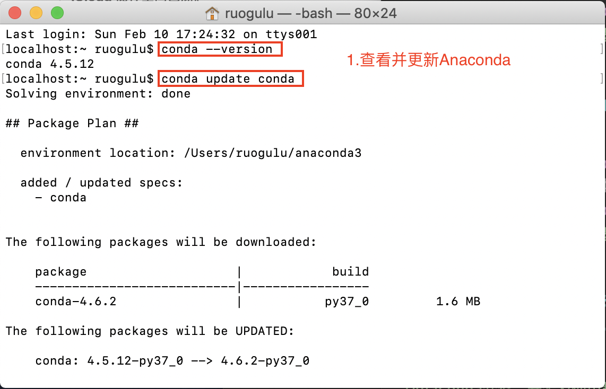
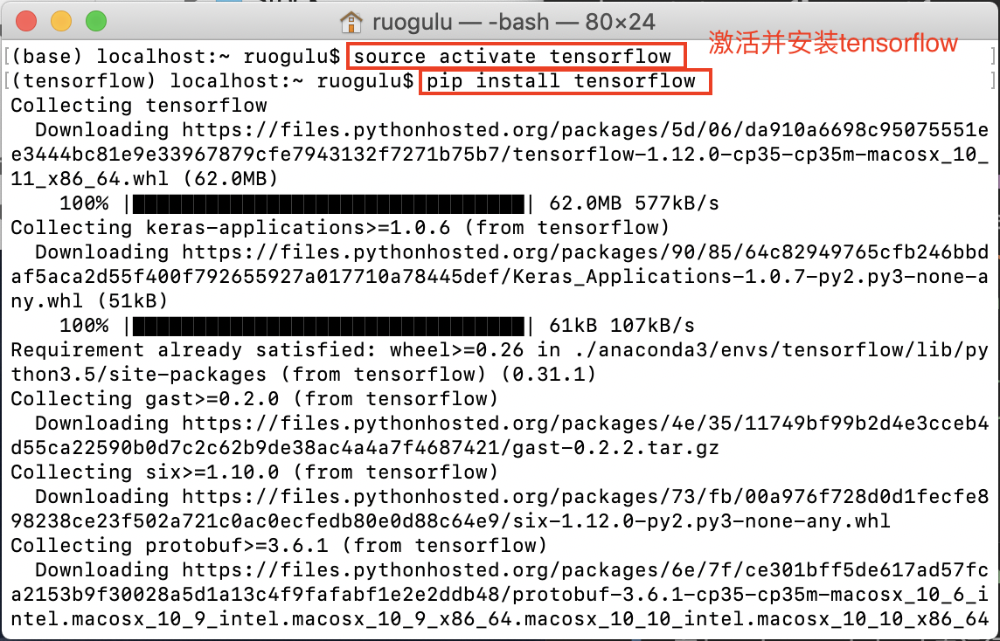
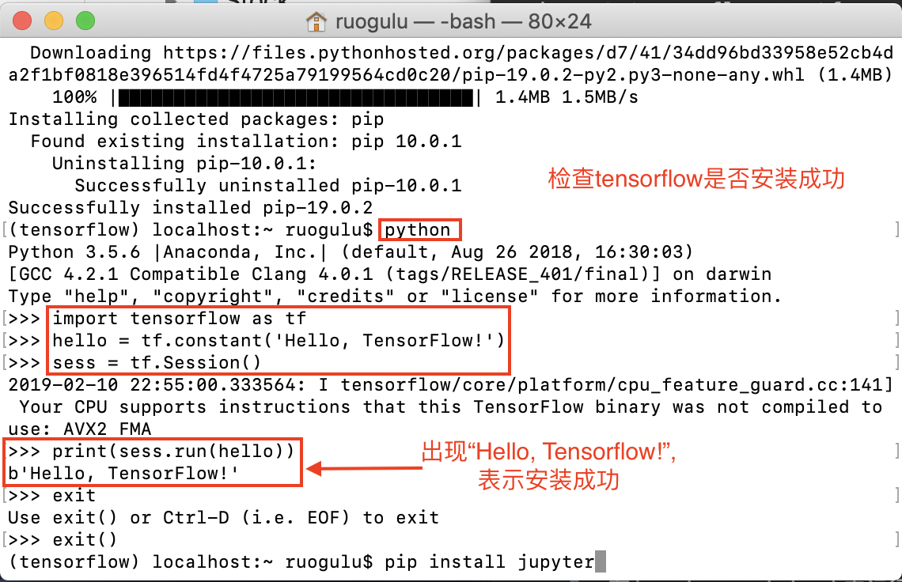
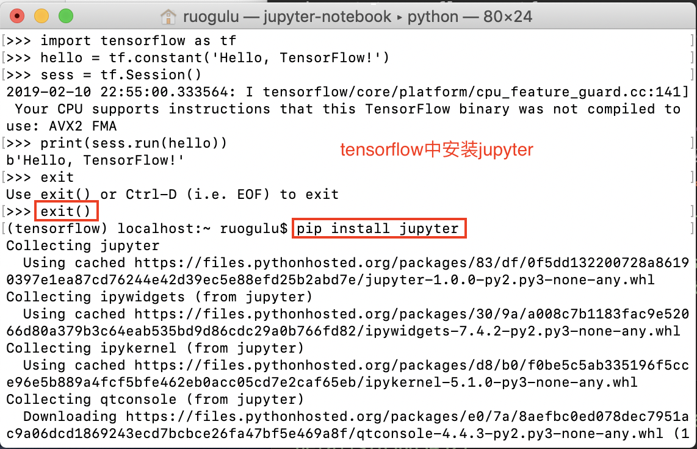
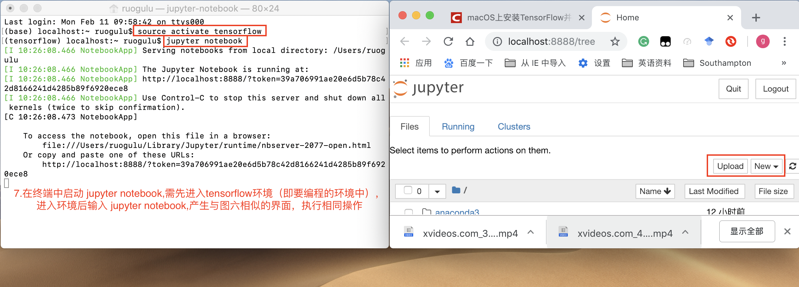
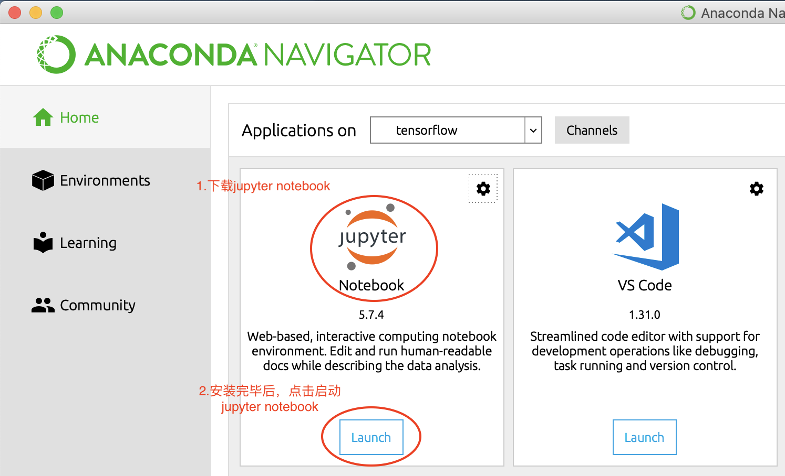
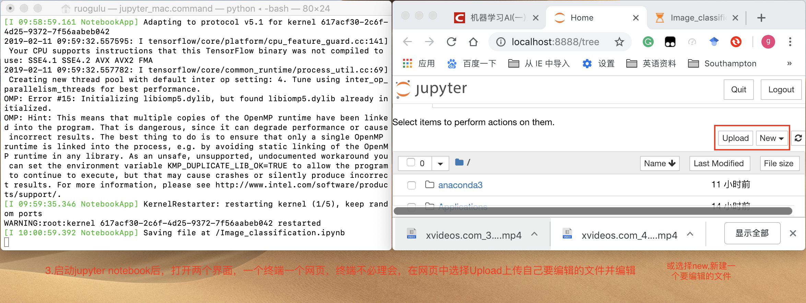
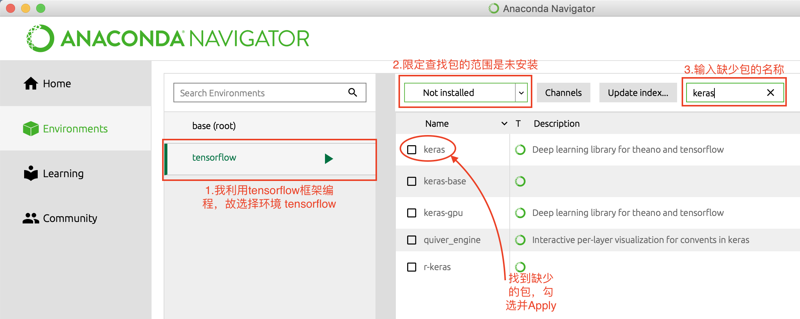

# Anaconda学习记录
学习使用Anaconda
  
## <div id="11-Anaconda简介">1.1 Anaconda简介</div>
>由于Python具有数量庞大的库，因此管理这些库以及对库作及时的维护成为既重要但复杂度又高的事情。Anaconda[（官方网站）](https://www.anaconda.com/distribution/#macos)就是可以便捷获取包且对包能够进行管理，同时对环境可以统一管理的发行版本。Anaconda包含了conda、Python在内的超过180个科学包及其依赖项。
>
  
参考自[Anaconda介绍、安装及使用教程](https://zhuanlan.zhihu.com/p/32925500) 

### <div id="111-Anaconda、conda、pip、virtualenv的区别"> 1.1.1 Anaconda、conda、pip、virtualenv的区别</div>
 
+ Anaconda，Docker 和 Virtualenv都可以用来安装使用 tensorflow,那它们的区别是什么呢？  
&nbsp;&nbsp;&nbsp;&nbsp;&nbsp;&nbsp;&nbsp;Anaconda是可以便捷**获取包**且对**包**能够进行**管理**，同时对**环境**可以统一**管理**的python发行版本；  
&nbsp;&nbsp;&nbsp;&nbsp;&nbsp;&nbsp;&nbsp;Docker可以理解为**集装箱**，其中包含应用需要的**环境**及服务，并且保证各集装箱的环境互不影响；  
&nbsp;&nbsp;&nbsp;&nbsp;&nbsp;&nbsp;&nbsp;Virtualenv则是用于**创建**一个独立的Python**环境的工具**。
  
+ conda和pip都可以安装包，它们的区别是什么？  
&nbsp;&nbsp;&nbsp;&nbsp;&nbsp;&nbsp;&nbsp;conda除了是包安装工具外，还可以对**环境**进行**管理**，与Docker类似；  
&nbsp;&nbsp;&nbsp;&nbsp;&nbsp;&nbsp;&nbsp;pip是用于安装和管理软件包的包管理器。
 
## <div id="12-Anaconda安装使用Tensorflow">1.2 Anaconda安装使用Tensorflow</div>
1. **安装Anaconda**     
&nbsp;&nbsp;&nbsp;&nbsp;&nbsp;&nbsp;&nbsp;可以采取图形界面及终端命令方式安装，详见参考文献[Anaconda介绍、安装及使用教程](https://zhuanlan.zhihu.com/p/32925500)。安装完毕后可通过命令```conda --version```查看Anaconda版本并进行更新```conda update conda```,详情见如下：  
  
<center>图2-1.安装Anaconda</center>
2. **<div id="2">在Anaconda中激活安装tensorflow</div>**
&nbsp;&nbsp;&nbsp;&nbsp;&nbsp;&nbsp;&nbsp;安装Anaconda后需在其中创建一名为Tensorflow的环境，输入`$ conda create -n tensorflow python=3.5`。此时Anaconda中的Enviroment中会有一个Tensorflow环境，如下图所示：  

<center>图2-2.创建tensorflow环境</center> 
&nbsp;&nbsp;&nbsp;&nbsp;&nbsp;&nbsp;&nbsp;目前只安装了一个空的环境，仅有与Python3.5相关的一些包，我们要激活环境并安装，输入命令：
`
source activate tensorflow
`，  
然后安装tensorflow包，输入命令：  
`pip install tensorflow`，  
详情如下：  
  
<center>图2-2.激活Tensorflow环境</center>  
安装完毕后输入命令```python```并在终端中输入如下代码测试：

 > import tensorflow as tf  
 > hello = tf.constant('Hello, TensorFlow!')  
 > sess = tf.Session()  
 > print(sess.run(hello))	
  
 详情如下：  

<center>图2-3.检查安装</center>

3. **在tensorflow中安装Jupyter notebook**  
&nbsp;&nbsp;&nbsp;&nbsp;&nbsp;&nbsp;&nbsp;Jupyter Notebook是基于网页的用于交互计算的应用程序。其可被应用于全过程计算：开发、文档编写、运行代码和展示结果。个人理解就是一个功能较为丰富的代码编辑器。  
&nbsp;&nbsp;&nbsp;&nbsp;&nbsp;&nbsp;&nbsp;因为前面已安装了Anaconda，所以此时可以直接在Anaconda界面中选择Jupyter Notebook进行安装。但是此时只是在Anaconda中安装了Jupyter Notebook，还不能将其应用于Tensorflow环境（即打开Jupyter无法使用tensorflow），所以我们还要在Tensorflow环境中安装Jupyter Notebook，安装详情如下：  
  
<center>图2-4.安装Jypyter(Tensorflow)</center>
  
4. **在terminal中运行Tensorflow**  
&nbsp;&nbsp;&nbsp;&nbsp;&nbsp;&nbsp;&nbsp;见步骤[2](#2)或在terminal中打开Jupyter Notebook,在Jupyter notebook中运行Tensorflow，详情见下图：  
  
<center>图2-5.终端打开Jupyter Notebook</center>

5. **在jupyter notebook中运行tensorflow**  
&nbsp;&nbsp;&nbsp;&nbsp;&nbsp;&nbsp;&nbsp;在图形界面中开启jupyter notebook,详情如下：  
  
<center>图2-5.打开Anaconda</center>  
  
<center>图2-6.新建代码文件</center>  
	 
<font color=#FF0000 face="黑体">**注意：**在jupyter notebook 中编写并运行文件时可能会报错无法导入某个包：</font>   
**解决办法一：**  
	&nbsp;&nbsp;&nbsp;&nbsp;&nbsp;&nbsp;&nbsp;可以在 Anaconda Navigator 界面中选择 Enviroment 并选择对应的编程环境，查找并安装相应的包。详情如下： 
	
	<center>图2-1.安装对应包</center>  
**解决办法二：**  
	&nbsp;&nbsp;&nbsp;&nbsp;&nbsp;&nbsp;&nbsp;在环境界面显示已安装了对应包，可还是报错时（我遇到的情况是`no moduled named tensorflow`，即没有tensorflow模块），可以尝试对`pip`更新
`$ pip install --upgrade pip Collecting pip`  
或重新通过`pip`安装`tensorflow`  
`$ pip install tensorflow`。

## 1.3 参考
Anaconda简介：  
[1] 豆豆.[Anaconda介绍、安装及使用教程](https://zhuanlan.zhihu.com/p/32925500)  
[2] 刘允鹏.[如何通俗解释Docker是什么？](https://www.zhihu.com/question/28300645)  
  
Anaconda安装使用Tensorflow  
[1] 一蓑烟羽.[Mac下通过Anaconda安装Tensorflow](https://www.jianshu.com/p/d54546ab315e)  
[2] HardCookies.[macOS上安装TensorFlow并在Jupyter Notebook中使用](https://blog.csdn.net/james_616/article/details/79480476)  
[3] Zhongyu Kuang.[Trouble with TensorFlow in Jupyter Notebook](https://stackoverflow.com/questions/37061089/trouble-with-tensorflow-in-jupyter-notebook)  
[4] 王子谖.[机器学习AI(一)之anaconda](https://blog.csdn.net/qq_37486501/article/details/82861191)     
  

