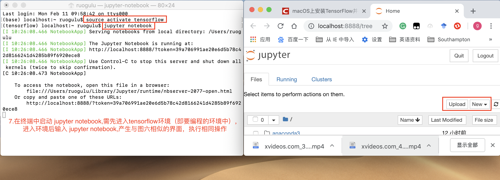

# Anaconda学习记录
学习使用Anaconda
  
## Anaconda简介
>由于Python具有数量庞大的库，因此管理这些库以及对库作及时的维护成为既重要但复杂度又高的事情。Anaconda[（官方网站）](https://www.anaconda.com/distribution/#macos)就是可以便捷获取包且对包能够进行管理，同时对环境可以统一管理的发行版本。Anaconda包含了conda、Python在内的超过180个科学包及其依赖项。
>
  
参考自[Anaconda介绍、安装及使用教程](https://zhuanlan.zhihu.com/p/32925500) 

## Anaconda、conda、pip、virtualenv的区别
 
+ Anaconda，Docker 和 Virtualenv都可以用来安装使用 tensorflow,那它们的区别是什么呢？  
&nbsp;&nbsp;&nbsp;&nbsp;&nbsp;&nbsp;&nbsp;Anaconda是可以便捷**获取包**且对**包**能够进行**管理**，同时对**环境**可以统一**管理**的python发行版本；  
&nbsp;&nbsp;&nbsp;&nbsp;&nbsp;&nbsp;&nbsp;Docker可以理解为**集装箱**，其中包含应用需要的**环境**及服务，并且保证各集装箱的环境互不影响；  
&nbsp;&nbsp;&nbsp;&nbsp;&nbsp;&nbsp;&nbsp;Virtualenv则是用于**创建**一个独立的Python**环境的工具**。
  
+ conda和pip都可以安装包，它们的区别是什么？  
&nbsp;&nbsp;&nbsp;&nbsp;&nbsp;&nbsp;&nbsp;conda除了是包安装工具外，还可以对**环境**进行**管理**，与Docker类似；  
&nbsp;&nbsp;&nbsp;&nbsp;&nbsp;&nbsp;&nbsp;pip是用于安装和管理软件包的包管理器。

  
参考链接：  
[Anaconda介绍、安装及使用教程](https://zhuanlan.zhihu.com/p/32925500)  
[如何通俗解释Docker是什么？](https://www.zhihu.com/question/28300645)
 
## <font color=#FF0000 face="黑体">Anaconda安装使用Tensorflow</font>
1. **安装Anaconda**    
&nbsp;&nbsp;&nbsp;&nbsp;&nbsp;&nbsp;&nbsp;可以采取图形界面及终端命令方式安装，详见参考文献[Anaconda介绍、安装及使用教程](https://zhuanlan.zhihu.com/p/32925500)。安装完毕后可通过命令```conda --version```查看Anaconda版本并进行更新```conda update conda```,详情见如下：  

2. **在Anaconda中激活安装tensorflow**  
&nbsp;&nbsp;&nbsp;&nbsp;&nbsp;&nbsp;&nbsp;[Mac下通过Anaconda安装Tensorflow](https://www.jianshu.com/p/d54546ab315e)  
&nbsp;&nbsp;&nbsp;&nbsp;&nbsp;&nbsp;&nbsp;此工作在终端中完成，详情如下：  
  

在激活tensorflow后只是创建了一个空环境，其中只包含一些与python3.5有关的包；激活环境后，终端前会多出```(tensorflow)```这一句，表示进入tensorflow环境。通过命令```pip install tensorflow```再次安装tensorflow。安装完毕后输入命令```python```并在终端中测试	
>import tensorflow as tf  
>hello = tf.constant('Hello, TensorFlow!')  
>sess = tf.Session()  
>print(sess.run(hello))	  

	&nbsp;&nbsp;&nbsp;&nbsp;&nbsp;&nbsp;&nbsp;若终端显示```Hello Tensorflow```则表示tensorflow安装成功。
3. **在tensorflow中安装jupyter notebook**  
	&nbsp;&nbsp;&nbsp;&nbsp;&nbsp;&nbsp;&nbsp;[macOS上安装TensorFlow并在Jupyter Notebook中使用](https://blog.csdn.net/james_616/article/details/79480476)  
	&nbsp;&nbsp;&nbsp;&nbsp;&nbsp;&nbsp;&nbsp;[Trouble with TensorFlow in Jupyter Notebook](https://stackoverflow.com/questions/37061089/trouble-with-tensorflow-in-jupyter-notebook)  
	&nbsp;&nbsp;&nbsp;&nbsp;&nbsp;&nbsp;&nbsp;详情([图四](4.png))。
4. **在terminal中运行tensorflow**  
	&nbsp;&nbsp;&nbsp;&nbsp;&nbsp;&nbsp;&nbsp;见步骤2.
5. **在jupyter notebook中运行tensorflow**  
	&nbsp;&nbsp;&nbsp;&nbsp;&nbsp;&nbsp;&nbsp;[机器学习AI(一)之anaconda](https://blog.csdn.net/qq_37486501/article/details/82861191)  
	&nbsp;&nbsp;&nbsp;&nbsp;&nbsp;&nbsp;&nbsp;[macOS上安装TensorFlow并在Jupyter Notebook中使用](https://blog.csdn.net/james_616/article/details/79480476)  
	&nbsp;&nbsp;&nbsp;&nbsp;&nbsp;&nbsp;&nbsp;在图形界面中开启jupyter notebook,详情如下：  
     
   <center>图1-1.打开Anaconda</center>  
     
   <center>图1-2.新建代码文件</center>
	&nbsp;&nbsp;&nbsp;&nbsp;&nbsp;&nbsp;&nbsp;在终端中开启jupyter notebook,详情如下：  
	  
	 
	<font color=#FF0000 face="黑体">**注意：**在jupyter notebook 中编写并运行文件时可能会报错无法导入某个包：</font>   
	**解决办法一：**  
	&nbsp;&nbsp;&nbsp;&nbsp;&nbsp;&nbsp;&nbsp;可以在 Anaconda Navigator 界面中选择 Enviroment 并选择对应的编程环境，查找并安装相应的包。详情如下： 
	
	<center>图2-1.安装对应包</center>  
	**解决办法二：**  
	&nbsp;&nbsp;&nbsp;&nbsp;&nbsp;&nbsp;&nbsp;在环境界面显示已安装了对应包，可还是报错时（我遇到的情况是`no moduled named tensorflow`，即没有tensorflow模块），可以尝试对`pip`更新
`$ pip install --upgrade pip Collecting pip`  
或重新通过`pip`安装`tensorflow`  
`$ pip install tensorflow`。
