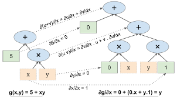
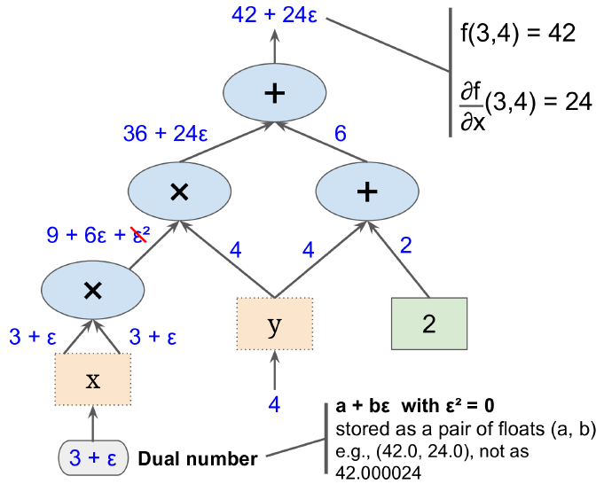

 
#<center><div id='算法中的数学'>自动微分</div></center>
&nbsp;&nbsp;&nbsp;&nbsp;&nbsp;&nbsp;&nbsp;在进行问题求解和优化时要不可避免的使用梯度。手工计算梯度过于复杂且容易出错，而各种编程环境提供了自动微分即自动计算梯度的方法。数值微分，符号微分，前向自动微分和后向自动微分是四种主要的自动微分方法。
## <div id="11-数值微分">1.1 数值微分</div>  
+ 定义  
&nbsp;&nbsp;&nbsp;&nbsp;&nbsp;&nbsp;&nbsp;用数字计算偏导的近似值，如函数 $h(x)$ 的导数 $h'(x_0)$ 为函数在点 $x_0$ 处的斜率，或用如下方程计算：$$h'(x_0)=\lim_{\epsilon \to 0} \frac{h(x_0+\epsilon)-h(x_0)}{\epsilon}\tag{1.1}$$  

+ 代码  

  ```python    
  def f(x,y):
        return(x**2*y+y+2)  
        
  def derivative(f, x, y, x_eps, y_eps)
        return(f(x+x_eps, y+y_eps)-f(x, y))/(x_eps+y_eps)
        
  df_dx = derivative(f, 3, 4, 0.00001, 0)
  df_dy = derivative(f, 3, 4, 0, 0.00001)
  ```  

+ 优缺点  
  优点：比较容易实现，是检查其它方法是否正确实施的好工具；可以处理用任意代码定义的函数。  
  缺点；准确度比较差，实现较为琐碎。  
  
&nbsp;&nbsp;&nbsp;&nbsp;&nbsp;&nbsp;&nbsp;我个人理解数值微分就是为变量赋予特定的值及其变化量，然后利用公式（1.1）计算该点处的偏导值。  
 
## <div id="12-符号微分">1.2 符号微分</div>   
+ 定义  
&nbsp;&nbsp;&nbsp;&nbsp;&nbsp;&nbsp;&nbsp;构建一个完全不同的图，通过微积分计算规则（如Mathematica, Maple等）自动求出函数导数的解析解<sup>1</sup>，本文将用一个例子进行较为详细的解释。  

+ 例子  
&nbsp;&nbsp;&nbsp;&nbsp;&nbsp;&nbsp;&nbsp;下图通过符号微分的方式求方程 $g(x,y)=5+xy$ 对 $x$ 的偏导数。   
<center></center>
<center>图1.1 符号微分</center>  
&nbsp;&nbsp;&nbsp;&nbsp;&nbsp;&nbsp;&nbsp;程序先计算叶子节点的偏导数。常数节点的偏导为0。变量$x$的偏导为1，同时变量$y$对$x$的偏导为0。由微积分的知识可知，两个函数$u$和$v$的乘积的偏导为：$\frac{\partial(u\times v)}{\partial x}=\frac{\partial u}{\partial x}\times v+\frac{\partial v}{\partial x}\times u$，所以$xy$的偏导为$0\times x+1\times y$。再由微积分知识可知，两个函数的和的偏导为它们各自偏导的和，所以$5+xy$的偏导为 $0+(0\times x+1\times y)=y$。  

+ 优缺点  
  优点：准确度较高。  
  缺点：对于复杂函数会产生巨大的图，导致性能降低，并且它不能处理用任意代码定义的函数。  

&nbsp;&nbsp;&nbsp;&nbsp;&nbsp;&nbsp;&nbsp;我个人理解符号微分就是利用微积分计算规则将偏导数用公式或符号的形式表示出来。

## <div id="13-前向微分">1.3 前向自动微分</div>  
+ 定义  
&nbsp;&nbsp;&nbsp;&nbsp;&nbsp;&nbsp;&nbsp;前向自动微分是数值微分与符号微分的结合体。它依赖于对偶数，即形如 $a+b\epsilon$ 的数字，其中 $a$ 和 $b$ 是实数，$\epsilon$ 是使 $\epsilon^2=0$（$\epsilon \neq 0$）的无限小数。类似于数值微分，都是为变量假设一个变化量。然后根据对偶数的相关操作可以得出 $h(a+b\epsilon)=h(a)+b h'(a)\epsilon$，建立计算图计算 $h(a+\epsilon)$ 的表达式，$\epsilon$ 前的系数即为函数的偏导数。具体使用可见下面的例子。  

+ 例子  
&nbsp;&nbsp;&nbsp;&nbsp;&nbsp;&nbsp;&nbsp;下图通过正向微分的方式求方程 $g(x,y)=x^2y+y+2$ 对 $x$ 的偏导数。  
<center></center>
<center>图1.2 前向微分</center>  
&nbsp;&nbsp;&nbsp;&nbsp;&nbsp;&nbsp;&nbsp; 当要求对 $y$ 的偏导数时再次使用该图，但参数修改为 $x=3, y=4+\epsilon$。  

+ 优缺点  
  优点：准确度较高；可以处理用任意代码定义的函数。  
  缺点：当函数中参数较多时，需要多次遍历图求得所有微分。   

## <div id="14-反向自动微分">1.4 反向自动微分</div>
+ 定义  
&nbsp;&nbsp;&nbsp;&nbsp;&nbsp;&nbsp;&nbsp;正向自动微分只需遍历图两次便可以求得函数所有微分，其思路类似于神经网络中的反向传播算法。它首先正向遍历图的每一个节点，，然后再反向遍历第二遍。在第一次遍历期间，它会算出所有节点的值，而第二次遍历时它会算出下一节点对上一节点的偏导数（将节点假设为一个变量$n$，即将节点视为一个整体，不关心其内部构成）。具体使用见如下例子。  

+ 例子  
&nbsp;&nbsp;&nbsp;&nbsp;&nbsp;&nbsp;&nbsp;下图通过反向自动微分求函数 $g(x,y)=x^2y+y+2$ 的所有偏导数。  
<center></center>
<center>图1.2 反向微分</center>  
&nbsp;&nbsp;&nbsp;&nbsp;&nbsp;&nbsp;&nbsp;节点右下角标示了当 $x=3$ 且 $y=4$ 时各节点的值。各节点被标记为 $n_1$ 到 $n_7$。第二次遍历求偏导利用的是链式法则：$\frac{\partial f}{\partial x}=\frac{\partial f}{\partial n_i}\times\frac{\partial n_i}{\partial x}$。  
 1. 易知，$f=n_7$，所以 $\frac{\partial f}{\partial n_7}=1$。  
 2. 由图可知，$n_7=n_5+n_6$，所以 $\frac{\partial n_7}{\partial n_5}=1$，那么 $\frac{\partial f}{\partial n_5}=\frac{\partial f}{\partial n_7}\times\frac{\partial n_7}{\partial n_5}=1$。  
 3. 与2同理，可以得到 $\frac{\partial f}{\partial n_6}=\frac{\partial f}{\partial n_7}\times\frac{\partial n_7}{\partial n_6}=1$。  
 4. 由图可知，$n_5=n_4\times n_2$，所以 $\frac{\partial n_5}{\partial n_4}=n2$ 且 $\frac{\partial n_5}{\partial n_2}=n_9$，那么 $\frac{\partial f}{\partial n_4}=\frac{\partial f}{\partial n_5}\times\frac{\partial n_5}{\partial n_4}=1\times n_2=4$ 且 $\frac{\partial f}{\partial n_2}=\frac{\partial f}{\partial n_5}\times\frac{\partial n_5}{\partial n_2}=1\times n_4=9$。  
 5. 与4同理，可以得到$\frac{\partial f}{\partial n_2}=\frac{\partial f}{\partial n_6}\times\frac{\partial n_6}{\partial n_2}=1$ 且 $\frac{\partial f}{\partial n_3}=\frac{\partial f}{\partial n_6}\times\frac{\partial n_6}{\partial n_3}=1$。
 6. 由图可知，$f=n_7=n_5+n_6=n_2\times n_4+n_2+n_3=y\times n_4+y$，所以 $\frac{\partial f}{\partial y}=n_4+1=10$。  
 7. 易知，$\frac{\partial n_4}{\partial x}=2x$，所以 $frac{\partial f}{\partial x}=4\times 2x=24$。  

+ 优缺点  
   优点：准确度较高；可以处理用任意代码定义的函数；速度快。  
   缺点：暂时不知道。    
 
## <div id="15-参考">1.5 参考</div>  
[1] inkfish-talk.[计算机求导的四种方法](http://www.10tiao.com/html/149/201607/2650470496/1.html)  
[2] Geron.[机器学习实战](https://book.douban.com/subject/30317874/)
